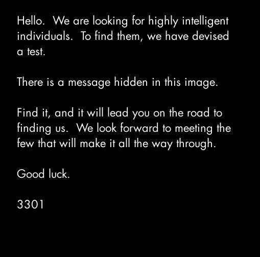

Previous Page -- [Next Page](../02.imgur)

# 2012.01 - 4chan

## final.jpg

In 2012, the following image was posted to [/b/](https://4chan.org/b/) with the file name `final.jpg`.



### File details

```bash
$ file final.jpg
final.jpg: JPEG image data, JFIF standard 1.01, aspect ratio, density 1x1, segment length 16, baseline, precision 8, 509x503, components 3
```

<details>
    <summary>For searching purposes</summary>

```

Hello. We are looking for highly intelligent individuals. To find them, we have devised a test.

There is a message hidden in the image. 

Find it, and it will lead you on the road to finding us. We look forward to meeting the few who will make it all the way through.

Good luck.

3301

```

</details>

## Solving

### Original Puzzle

Appended to the end of the [final.jpg] is a message that says: 

> TIBERIVS CLAVDIVS CAESAR says "lxxt>33m2mqkyv2gsq3q=w]O2ntk"

You can reveal it by using your favorite hex editor (I like ghex) or by running:

```bash
$ hexdump -C final.jpg
...
*
00007210  51 45 14 00 51 45 14 00  51 45 14 00 51 45 14 01  |QE..QE..QE..QE..|
00007220  ff d9 54 49 42 45 52 49  56 53 20 43 4c 41 56 44  |..TIBERIVS CLAVD|
00007230  49 56 53 20 43 41 45 53  41 52 20 73 61 79 73 20  |IVS CAESAR says |
00007240  22 6c 78 78 74 3e 33 33  6d 32 6d 71 6b 79 76 32  |"lxxt>33m2mqkyv2|
00007250  67 73 71 33 71 3d 77 5d  4f 32 6e 74 6b 22 0a     |gsq3q=w]O2ntk".|
0000725f
``` 

* [Full hexdump](dump/hexdump.txt)

The solution is a *ROT cipher using an ASCII +4 shift*.
This can be calculated by counting the shift from l to h. We know this is an `h` because the format is revealing of a URL.

```bash
$ perl -e 'print ord("h")-ord("l"),chr(10)' # Verification of cipher shift
-4
$ echo "lxxt&gt;33m2mqkyv2gsq3q=w]O2ntk" | perl -pne 'chomp;s{(.)}{chr(ord($1)-4)}sgex;$_.=chr(10)' # Decoding
http"cp7//i.imgur.com/m9sYK.jpg
```

The solved url is finally [http://i.imgur.com/m9sYK.jpg](../02.imgur), a picture of a duck.

### OutGuess

In the [duck picture](../02.imgur) we were given a hint to use OutGuess.

```bash
outguess -r final.jpg final.jpg.outguess.txt
```

<details>
    <summary>Outguess Output</summary>
    
```

Here is a book code.  To find the book, and more information, go to http://www.reddit.com/r/a2e7j6ic78h0j/

1:20
2:3
3:5
4:20
5:5
6:53
7:1
8:8
9:2
10:4
11:8
12:4
13:13
14:4
15:8
16:4
17:5
18:14
19:7
20:31
21:12
22:36
23:2
24:3
25:5
26:65
27:5
28:1
29:2
30:18
31:32
32:10
33:3
34:25
35:10
36:7
37:20
38:10
39:32
40:4
41:40
42:11
43:9
44:13
45:6
46:3
47:5
48:43
49:17
50:13
51:4
52:2
53:18
54:4
55:6
56:4
57:24
58:64
59:5
60:37
61:60
62:12
63:6
64:8
65:5
66:18
67:45
68:10
69:2
70:17
71:9
72:20
73:2
74:34
75:13
76:21


Good luck.

3301

```

</details>

* [OutGuess result (text file)](outguess/final.jpg.outguess.txt)

## Future Discoveries

* After calling the [phone number](../03.subreddit/02.phone_number) later in the puzzle we find out that `3301 * width * height = 845145127` which gave [845145127.com](../03.subreddit/03.845145127.com) (now dead) 

## Interesting

### The image dimensions match the [Valēte! image but (flipped)](../03.subreddit#valēte-image), and the [two images the QR codes pointed to (scroll past posters)](../03.subreddit#qr-codes)

## References

### In Wiki

1. [2012.02 Imgur Decoy Duck](../02.imgur) which gave us the hint to use outguess on the image.
2. [2012.03 Subreddit Book Code](../03.subreddit)  which tells us to go back and multiply the dimensions by 3301 to get [845145127.com](../03.subreddit/03.845145127.com)

### Tools

1. [hexdump](http://man7.org/linux/man-pages/man1/hexdump.1.html) - to view the hex of binary files
2. [outguess](http://web.archive.org/web/20150419030527/http://www.outguess.org/) - steganography tool to extract or hide text in images

### Ciphers

1. [ROT Cipher using ASCII+4](https://en.wikipedia.org/wiki/ROT13) - Used to decode appended text to image.
    * [Decoder](https://www.dcode.fr/rot-cipher)

Previous Page -- [Next Page](../02.imgur)
