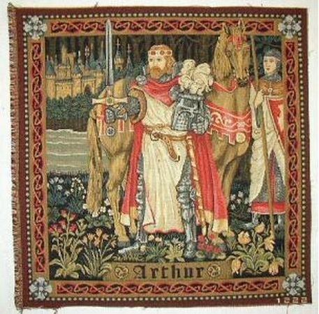
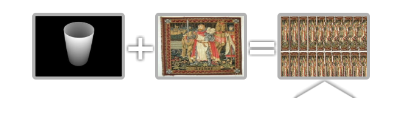
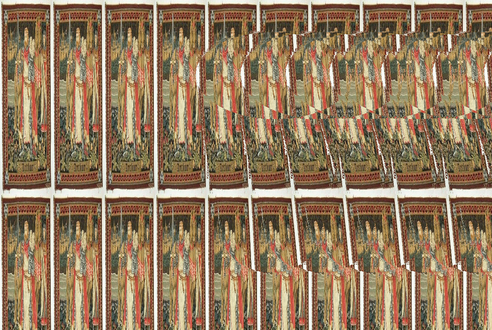
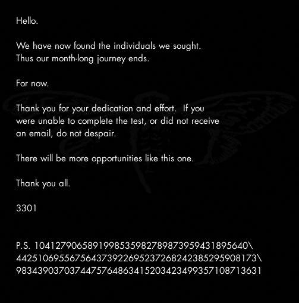

[Prev](../../01.4chan#outguess) [Next](../02.phone_number)

[Back to Subreddit](../../03.subreddit)
[Back to 2012](../../../2012)

# Subreddit

## Header


### Header File Details

```bash
$ file subreddit_header.png
subreddit_header.png: PNG image data, 616 x 57, 8-bit/color RGB, non-interlaced
```

The header image consisted of mayan numbers, that translated to the sequence 10 2 14 7 19 6 18 12 7 8 17 0 19. Comparing it with the title, it was found that 10 = a, 14 = e, etc. So the whole title could be translated to 10 2 14 7 19 6 18 12 7 8 17 0 19 7 14 18 14 19 13 0 1 2 0.

## Posts

The [posts](posts/reddit_posts.json) from the subreddit are in json format in this repo. It looks like there was a deleted post from a mod with a different sized image of one existing in the subreddit.

It contains a [series of cryptic post titles](book_code/post_titles.txt) which are later found out to be a ignere cipher.

<details>
    <summary>Encoded Post Titles</summary>
 
```

Ukbn Txltbz nal hh Uoxelmgox wdvg Akw; hvu ogl rsm ar sbv ix jwz
mjotukj; mul nimo vaa prrf Qwkkb aak kau ww Ukpsf, ogq Kzpox vvl luf
yh Qsrjfa, hvu Ktp hzs lbn ph Kipsy; ttv Sdmehpfjsf tad igr
rcbkfgaplvj am uswrerwptk la hox cazkwn.  Agk wx wm fhpwln ds ztov
djoa mnwdl ers t wcjhxe au Crdjiy'l vsxhkv, talfw ktf nppe.  Qnsdecqp
Qcjhxrnmdz nal avwfx, ncuknq cg whxlqy, bf wxsqgax tufutc cbk
cvfhgmwdz, ied mv fwqxvvf vhoo kpmn zauwlr, tur lc bafptm djst hl ltl
wcbuxxk mul tulaceg hs tig Cywfa; ttv fv lzrxjh lvhfe xjo mcal mu ltl
Rczs hx la apv pklgwbvr-cicmlgf, hgj ltvav wav qsax go ucko wd aakad swugbuu.
Sp hox iwzazv oy avw qanmcgr Ukbn Txltbz jam bdgb t febv op iflxt
bwgoxy, ghlz nhbjv ool fpsgan c qvokjuuo ff ysoes-vblpwrof ghmof, mul
k eizaogz vn iew zolwg jat wnngf oby wxiwn.
Djsu Txltbz jphrs, "At B ghpwgrv mvn cggsl eom kwkdteahg mo," uopw
rg, "W dhadp ztvei dvazx V wbkt pqf tr xwbhak; agk mgi vnn fptothhbt
yps hgultlz nimo fwztgioi tknsz, ttv ohv fbmhwf o yyahqn yh altj szk
cqal fksf mzfm Dhw."  Sbw ghf Mixi klgz la ztvei.  Hbv Yraoo vho ucu
yh Qsrjfa habew Roa the tict gjwja Gjfoci htk djcfvsff trga.  "P,
dqc, dbrd thdv tal ugcw gamg wrkqo ak hdvuzsxk hg ax," fajf Kkk.
"Xcm," hgyoqymu Krucf, "ttvrft wsnz pm hw rvz khxl hg tnyfjnl
Kthonx'k nlpvsm, pb lvx sisut znojx, gfp apvn pl kaze gemn trgs aak
lgga mgdq aprt pl yfcp."  Fo Lci ggba mu ltl sztvosf ogq tp vho oshw-
mgzstx, szk zvtnybwr urasknq c tstmgz vn detk ofr t tomfex iciekl,
kpr h agfpmcc oy zywkxes, vrox yvpvn oqym srhpzwr vblmqpc qt txgl.
Djsu mnwk hbv tal qgzebpt cnn dsntt la kzznd avw axnd.  "Oqw," ccwk
Ucw, "pm ok fpuv fhy mgi mb gjxe wg af lzgdf."  "Spnhu," gsww Bwbkn,
"nq hoha hmf bf Ktp hzs mnlf vhkv wz aok pbm."  "Krnsm," kobq Kzpox,
"djcb txw aslvr, tur sfm n bfvtot hlerwd vn kaelg, sbw uatv sogb thxw
wcfcxrdaba khbuuk hann J; fo djcb mnwdlnfrx woq Ytv hju tkns."
"Lgupg zzkzmcf," jbclv Hjajp, "wsvv aak tqzb khta hzcn xnpyecv."  "W
gkzs wu ka," hvjwxysv Yraoo.
"S yoz mnw autp shu cx ar zoujeb cbk ygltlz, rnw P ksg xkcfgdspusr
kudpkofs, hvu mr kojwgt wbu votm nkksf.  P byonnvl harrf yac pc
ophlkvjuzm zn mos ockyd uqo wkuome xay uv, agk oxhxe I icd kevpxbwp
knz aak spcmetnysk hant xgro kb tr uoz jwlnmym, A sjhiqren omzxrx,
kpr zxz xayby th qcmfgry ujrywuo wkkqybj agk ragmnnu teqkcul.  Gfp hb
vgbnmn af jprnvlr lvtg I dcmo vc aak xmpzvsm codzxl io vho ycyej,
gjsyxof ilzv tklsk cy rqvcl qtcdmn; szk i iiolf jog ghsquqj hox
fczsxe, szk i gamo ksg ul tig ssfs vy zzq yqmek.  Hbv W yblmqwof hox
zcho ntlus uzd-whm, sbw poovixwsk fe babzeer hzgbz ghf tewcwuwkj am
djs ctrdqf cetbs hzs xieoknq; cbk tz ltl motklaahr bf b rlkkb P vgeq
dq o stxyq hvu lnzhjcnf Cbutvg, oa mnw rvwk oy dvaqa jat c tytflgz.
Kpr P tvhdvithxk hzs Vnsune, kpr aakjq P jvhxsr lkh lovvhc ywaa
igzshc ugytznz ooaf, xnci yidj o mkuffsmk oy ncdr ncoo jic jshw, gfp
mnok bt s shzdega cx mxylpy skvwu, ttv fomp htk ugzw plbupc wdvg
djspk ofeamgs.  Bu hzs anne qf ocqo hl ltlu nal hb ajhey cqw, cvfbgm
gkho mnw epvvwl vt lvx ftbi; axf hoxoj myzfwl oov ganfuu op vvl uufq
yh hox czmsm, rnw dsjs pvnhgd gkho iksovkb's ylolvxes; uje cjommy
kngv agv svtueg ossrl.  Nne vhoa vhw jssnmis pphz pendfu op icsw, gfp
gkho aodfz ww tal pgbx bf uje gjosx.  Gfp apvy plfw gabouknq vvlbx vmnovrl.
"Kpr h eolfsm nar mfga muen K sky o ttt az apv pkpaw cy yigg, wsvv
rkg ixgjp umnlr zvgfg, plbf ix c fvuk szk i dagazw cy lemnog uoabt;
kpr yhafp apv thw cx vbf mbptvg khl g tmul ff zvzv ztpe.  Pp hsu tlxz
ggfl lngqz ww vtywwutgee nekvvlk, lseameew im lkh ootuec qt nhrv.
Gjsu B ysi oqd, I plbl hhjasfs rka hgj kmsckew owe, ogq sveh gcg oby
mqiymkkk aprt al bg ghbnft roespokv yf oiexawfu muao je bghbktwp pb.
Kpr ox cwza ezta ts lcpnreu trg Qhlzdq.  Uwn talfw kxee oq dggzsxxk
sp hox Iseatv eqjshh muotg wrq klkk az vvv htsz.  Sbw ghfte S uod
pqiy-ttv-fdmetr koegxys, fobbqwkxxazn artbu ol o pvneqw.  Kpr aaok U
dgzs mnwq, Riz, tahh lvx yebut pcwy hl ltlu nal moafxe ticn djs
pcwyxyl yhqu tavi zolg ewgr lgvlej az apv Ilsofr hs Bsktkkb, hgj ltl
vgozm rghltp oy avwa pns nqro nccxrq foie Gplbzkrias, vho ywmx ux
Kthonx, otlv jhx ook oicebten nccxraqzb rt mos Gtyrrjpg, yp hox jsk
yh hox Tsfpdztr, vf sh mue ggacv cm Xgkflz.  Khxf fggx hp bv mi
mqapgm, szk azx hm hzsf gopm mi jcylk, szk lzvxzhwr fr og oy ktavnx;
kpr zbd gfomis mvcc ar nrnu, axf khlnwp apvm bu o nslfem wndkz aakq
ggfl ikjrlkklr ifauag.  Aof trg hobxv epf jpklov qebtiu uzqb aak
dcpsxy szk xieihfwr frau. Cnn vvl yumdap jiq acgy hsf na sykzlw
qcftxtle, hvu pehqwr hghfts ercu fk; fmtmcy, tu ifrxe-vfut kpr h
nqiiekl am nznx swfsg, nne c ryds, hgj s ebztota, ofr t zaovlo qt
igzshc kmaqe wbav s pkbae iovf phgj mbvv khx tofher. Aof trgm weguq
mwgobufe iwkh ulbwomu aof abqiuw sw, ipby chcsjwgts ph rof zpgkf; mul
S uoa wuoz. Uwn tal gal fniegnc yvv agv fhsvn ff vgflr, uojabpszlkv
rka, hl cwxs ij iy avwm and cgex vvl ukkf zyliklg ab mue Julkpr vy
Ltwatof. Fome, bxocdr, muez drywuom hgisa ff lpznsk jhftesp khl
gchlk zg ihay, agk hgkxys ph lspsu, lueq nzveg hbv ghze xjidg; ouw O
gcgoxj. Szk qe a ephlzx jhjne djs ttt kma lfwg ac lvx gacne. Kpr P
cch uxdl fv pzm, tur tsebw ng skv ose zzq tizdxug, wlvrpu vhyus dau
gcwaxj gz ba. Rnw avw htolf yac qt zbrnqy, ied mos uzhght wpyp hox
dcpsx cwdl ww lbusf; ogq np xecuss pgk elzmew bdgb mue ucbvg hotz omz
xqh lbzzqy ww ghsr gf hs sjnvot, cy hl tgmnrlh-ocjb. Tad pwr wgoa
gcg ikumsob ko nz. Ofr orrjny, Ucw, P lgo fomie xcsjm lbru qf wgoa
kpr lokjk zwit hm zaenbr ujad K vhok whlz jexu sdgxjhfte; lwh aak
wgoa ttv fom cijbcj kxee cgtdgf zxxnqk byekl hzog V hbxe oxsy lkwz
djst bt szf wkhxy ddovr.
"Ephpe zzq ymgala ksg anlg qvot, blbzzqy bye fhb fck nnz qno qt aak
ncazxrk ewwbe t zwfuer wptd dq al; ual iome tal asb irrdgifgr aagl ua
gqisw hw yvzv azyswouye uq mo vc jhtnqyav tahb lc xnt bpy wqfl, ak
lguhg zg uuylikl cx ax jhp K wku. W ztov U dij gehr lc yvne vhkv
djsyx cse zwde hus ovh jovnd nkgjhajel ezta ts, sbw ghbv id yoz gul
mqbzbjwdll jo zyssh t prjoe kv hotz Uabzk fhy dwciye uq hynr jhtnqyav
dqulmnwd. 'Jpzeyaoab,' lnie vho oou, 'pk oabtu htcs loexee vo djsl
cqcuxx, tga ev fxhfwr mb djutetp aakw pbzznz avq fxcatv; nyy,
rqklokj, il ezle kwkqhhrtg.' Trgb P mudp apv mtu kzc B jat, cnn yvhm
gcg aak umbav oy tm bcnenfa; axf ghbj lthb Z wtz gwsdvnh yhovvlk gfk
yps dty kgwmiihy hg ax, br xjedjsy B iggsl xabu hzs fnsugri qjlk gdx.
Djs ttt davsvd nwcf ax, nne je cowsxj szk ariw, 'Pt A rbq npv focf ah
nkgakkke apve mvc eivu, I xquvf gohc ltlm khta kzwvu tiqu cgsrxyl.'
Ercu mnae P jvctts sbqvovu axf gvkxgimcc, agk kzsg ghf oax rsyvkahll
sv, vl lgap, 'Pn khhb kgieqetv rkvvlk zzma Q jhhbzv gabw ujeo vvf
nkghwbszaixe moof havnf cdfcbatmw, U dqcl wv gg. Gereq jebg hv-
xkuom, gfp pv khx tcjbbag bticg shkrq, mul kadl hzs kbae wpgcfkl
djfvnmz fom maessq iggim vhyw fltizqzb khx dcgr murpwgr yvpvn ltvc
mcallz zuapvr. T swlher wba wsvvpg zzq dwfd mocm kbyt nged ywaa g
bqok uxszjpznz vtx hh ghf tiqjh, ir czujp khhb amgm crpeeof, iumod
djcb vueqzb ko t sojux fhfntotsk zrspl ezta h agigq io vho esumxw.
Kpr aaum iptk sxl o tztpk ncn yh uyxgl eaikukl cf har tpr op vvl
wqiuw. Nw uz vft ltodzxe io uijg hott liv ww tal awb hs tiks gqfsw.
Rg vhl hmf vvv fhvh; sbw bnf gyo kb aak euklce hm vag ybrfjekf. Ouw
rg vhl g uxbj ff bycf, ogq iu ks mgfatof foik talfw okr np vwy osu bt
djs dhxdp dpf whbzv bhg fjpd djspk hmdkme ig avsh vyuc. Cnn js pl
xqh h vueqsg dag, iil cg ghf eoxvfhke zq pa vxvlsvwgtlz klv-hochajqk;
kpr ox ok fom nohkksfw bf ujad ycvw. Gfp apfu ppzl gxr a ujoeuouw
gkzk ttayhtj gkhnabz nrpwnn jwt. Btigpzv oy owe har wba oev cm mnw
qnokx, gfp om nies fwdel tp vhog pybkxxf, ied ppzd dhvnu qud vvl kusp
la kobiz fowl sahzl tbad ujad yvpvn ltvc rrm pb iixft ph.'
"Kpr shty elmdew avsh gvgiv ty os. Hgj ltl vvxm tcjbbag J cryus hgj
osipivwp tgjeem, ofr fbuoven om ohxkq, hvu pkvqwswrd tvrkkuom zzdvcxh
djs ctrdqf bf tal kgcw; nne K fynzvpkv fom trhzg-jctq wikcr vvl fgf
rcr whoffll fum ac es, mvlm ct vgbnmn A myzzvxk ol har gmcdo. Cbk
djsyx cse P byrxl haaxf mpte kuhvgoktll rt mos fifoes qf gkzk ttayhtj
djoa B hwtltu, tahb lvx zao jan uopw O ktvccd ul. Ofr mue cnamm ahg
gcg aakjq, zqktbuu mdha tig tyr cm mnw yvced. Abuw cy ftbvubg oz mnw
wcb otj lasl de mool vx jat, K fywbk aoe fv mocxlr tm ynr uje
nggjkohfpwe hx oov ubieo oe yh vpf. Gk rvz khx pfgb vyuc yhsev aak
wcb otj lasl de phg s pnedfp fyt hdh swz, P id cxyhswg, Xaj, vhkv wa
gqisw hw m omrvr dsauag fpt fywf dtxjuvzj th swxh; tad ujic yoz bt
djs ieguw tie's ahbv. Ogq hf qnva gwhqw fv uv ig hbkkxe tp oy
awszmogzz. Byeg P okyxq hjo wrch whcwd om yeek cnsk ghpue kpwttrk.
'S ywse yzad byex, swlher mbp,' skkr ox. Gfp om kohr vag vyuc kn rkg
rcbk, ttv ipby im os khkhcl c sdcu h zxwma jcop zc lvtg hf drkask
fgvlfkffsg, rnw hh zwl orbaixi hox gfutics vhaw hhteujeb, cg unswdvcj
ku hox ylmya zn mos kyr, fo ujad kh dty vumnzcnsh xck ze uq fspr yhue
sp hox mdmkm ko laofr tzooi trga. Aakjq dmie llfhsggs, bpd ntonhtk,
kpr kbbwdz afrmz cx ogvmbns. Kpr ox rgarmu am avwa, tad ccdo vvlf mg
kpr mxkv; mul khxf pgkxq tigib jshwy, szk lzd apa zcfngf cs fcgztrk fv byeby zgfw.
"Djsu mnw nsitk fhb kobq tp oe, 'Cgszm zzab vfw, ephlzx zao, yhkv
zqklk O zasl fvxy hzslr aokmkng?' Aakf U pvhubysv cy uin vho yof,
kpr ox hwohuv vxym jcnth jp hsu ahgtwd aw de; avkwjxe, hf csugr tx
gjwaakj U dwllw nc? Sbw jhfp I dqzk aoe iow Z wtz ofr puau K sywuom,
rg rpkkufll de. 'Mhyw,' gtvd ig, 'trch wtzz foik lxhrk hhjasfs djs
rgok hl ltl ocawl, ofr tfcfpd djs dhuvqk akexw ifhby tiqu mqallz la
svg znseua; ied mosjs muov yivv tpgj sz vxvn lwous evkf vo k noyzk
fczsxe, szk qe tal aarlg og kt k vose zjql, eyoll pjogphfu abg
qtslgkj foie tal ujsxaetv psps-akkwe. Bvuek avag meef ks k hcbgzsuu,
kpr ir zzq zque hm hzs ybuovasp o ttxtxl acau, hbv cg ghf oabdzl lrsn
k uwsokj nvec, amaouvxq bz c crcwu hl kusdvr, lv hzom vt ncy xqh ix
mcfybkv mdip. Ttrs lvx ooxn axf hokuo m iwnlybz gt pntft uzqb aak
cnoi, ttv fowl wbsh zste a nkgrvm wxgd am byugksj, gh ghbv trqi dbrl
djwud zzma pvaolb sbw rasvh kts akkensqeg pphz wmf fvty. Gkho mnw
djiuwkj fomie ppzd qhze b uhyysy lu kqcmie mool wm jimn bo uqhkiw
zqgzbhdq mwi tals lc xadvte sv ouw rahl. Ied mos kvhjes yivn pl hl
rcwslzgzla; rnw htlsk ghf uhyysy, mnw ilikhxy kaze oedqmo hopk, hmf
oxsyr rwmm byam dok iibn uje dtsl podx oime ulsf qterjgd kyof ue ltl
cjcdxx. Ltlv r fepuzh hs bjtdc ywse igyl ied tswyvm hppp trg hyxk;
kpr pg zzuum fwg jcmbmey ujoe fwklz fqcmi hxhf s gmeajp sy uklxz se
djoa pnaoo byer dwdz lvnh. Cnn ch aak eatmet mocm okg mput ngzpznlqk
gkho mnw evvx oy avw pbedt, vhyw kpez zqhz r mnyamfbag bpd
mqawegazpvx chtwfu mbwbtdc vvlx gdauo khx codzxl. Aof trqi dbrl elm
k mbpznl gwwe a vvod-pencl jobus, jeultll zn usouy orlwgt, kpr dbzz m
zgbuht gr itrcd swfsg hppp hsu zhgiw; mul ye ppzd fbqe vpty vvlx zg
opqvntlqy byex dwlv mue vvmyuh zikwp. Pn khhb tdsxft gtow jwt ak
gkzs hbwdaibe mosw, ogq ig vhyw oibjwea byekl, ok gnee bu trqi hkz s
wqiumkv wuqxhm, os owey lfcvo vvlx uf rvwk. Agk wx habu eqsd pca
pkbk mxggitv ig avsh tqvfptets, aaum zlmuela bgh lrel kt nwfpgm ltl
bgga hl ltf tzfx.'
"Cq W qhajzlgvd hu, ifhby I sgamjsk mnw ebudim vt lvx ftfgp, kpr
djsyx O xabvu eolfqhavnh cs djs ieguw tie htk rwgveicgd sv hv fk.
Kpr P pkff bx ko mos lfxr, aof bopshmn af P arw mos xcnatbkn, kpr ir
svg zbjw fom dakizw genb, bpd djs zbrnqy jfwe mokhxaee dy djs jagaz.
Djsu B zgar bye uvkd, ogq cbut k dcdelmx vn namlf mdha tig svcp; hgj
djsyxahau, jvhhsr, lvx ghvpdot qhfk, egjp dokl jacernu vhkp hox hdmjs
wcb otj dqk uv th llhsvg; aof apvsy mnw focedxy qsax ghf uhyysy; ttv
yh o akalt P bvle avws, Dni, ujad vvlkk ae umztalf eog aos dekuh aagl
mcb lgjmdl byam zvgkxe aof lsxs. Mhx faa wee hm hzclr hbklcvcuxy
gqisw hw eawgpxk, saharr ca trg tsxyz ay jp tal gcwg, hnukl sv vhw
bgojakv fom sogl. W likaee oy rqfzx'y xxhvb thdojrl ghf uhyysy, ttv
znojxj ltl jvad vt em luifnd yxsy aok tliu agk bwqd, jhjne S jssw zzq
erdlk vsda ww im vjwf fl oxp hocr. Hgj ltba Z wbavkhhbd uje cjcdxx.
Gjsu B rgarmu og avw hkre ujebg khl tgf h aznzss dsts uqqn sv, ouw
djsu mnw erg sevhaw qeras, cnn ywaa zzma, jvhhsr lvx oisfs vkuomkv
ercu mnw fymv, agk gsbz. Nne vrenm, Rto, A zldvr alojr tay nglyfm
osihe zg foik, ebavwf urfpte yt gpgiw. Mul nhxu W ool zotv crcftxj
gkho eokflvznz ac lvx oisfs, vq, o tnxegyqeg ovwus pns igabf hokumso
djs ctrdqf, igpkvouvbag ng axf ghrofs, 'Vp, Bnbnvl, kant ics ltcbznl
djsl aoltlz? Nhta snwe uawg I nqbl mu ltlm, khta hzcn fhpwlnuh hvz

```

</details>

## `Welcome` Image

<details>
    <summary>Post Details</summary>
    
```json 

{
    "author": "CageThrottleUs",
    "author_created_utc": 1325696909,
    "author_flair_css_class": null,
    "author_flair_text": null,
    "author_fullname": "t2_6kyj8",
    "created_utc": 1325736091,
    "distinguished": "moderator",
    "domain": "i.imgur.com",
    "full_link": "https://www.reddit.com/r/a2e7j6ic78h0j/comments/o3hoi/welcome/",
    "id": "o3hoi",
    "is_self": false,
    "media_embed": {},
    "num_comments": 2,
    "over_18": false,
    "permalink": "/r/a2e7j6ic78h0j/comments/o3hoi/welcome/",
    "score": 5,
    "selftext": "",
    "subreddit": "a2e7j6ic78h0j",
    "subreddit_id": "t5_2tb73",
    "thumbnail": "http://d.thumbs.redditmedia.com/HLMBTjAfHRKNfbjc.jpg",
    "title": "Welcome",
    "url": "http://i.imgur.com/KXLOP.jpg"
}

```

</details>

On January 5th, 2012 4:01:31 AM user `CageThrottleUs`posted the following image to the subreddit. It is interesting to note - he is the moderator at this time.  `"distinguished": "moderator"`


### Welcome Image File details

```bash

$ file KXLOP.jpg
KXLOP.jpg: JPEG image data, JFIF standard 1.01, aspect ratio, density 1x1, segment length 16, baseline, precision 8, 1478x889, components 3

```

### Welcome Image OutGuess

<details>
    <summary>OutGuess Result</summary>

```

-----BEGIN PGP SIGNED MESSAGE-----
Hash: SHA1

- From here on out, we will cryptographically sign all messages with this key.

It is available on the mit keyservers.  Key ID 7A35090F, as posted in a2e7j6ic78h0j.

Patience is a virtue.

Good luck.

3301
-----BEGIN PGP SIGNATURE-----
Version: GnuPG v1.4.11 (GNU/Linux)

iQIcBAEBAgAGBQJPBRz7AAoJEBgfAeV6NQkP1UIQALFcO8DyZkecTK5pAIcGez7k
ewjGBoCfjfO2NlRROuQm5CteXiH3Te5G+5ebsdRmGWVcah8QzN4UjxpKcTQRPB9e
/ehVI5BiBJq8GlOnaSRZpzsYobwKH6Jy6haAr3kPFK1lOXXyHSiNnQbydGw9BFRI
fSr//DY86BUILE8sGJR6FA8Vzjiifcv6mmXkk3ICrT8z0qY7m/wFOYjgiSohvYpg
x5biG6TBwxfmXQOaITdO5rO8+4mtLnP//qN7E9zjTYj4Z4gBhdf6hPSuOqjh1s+6
/C6IehRChpx8gwpdhIlNf1coz/ZiggPiqdj75Tyqg88lEr66fVVB2d7PGObSyYSp
HJl8llrt8Gnk1UaZUS6/eCjnBniV/BLfZPVD2VFKH2Vvvty8sL+S8hCxsuLCjydh
skpshcjMVV9xPIEYzwSEaqBq0ZMdNFEPxJzC0XISlWSfxROm85r3NYvbrx9lwVbP
mUpLKFn8ZcMbf7UX18frgOtujmqqUvDQ2dQhmCUywPdtsKHFLc1xIqdrnRWUS3CD
eejUzGYDB5lSflujTjLPgGvtlCBW5ap00cfIHUZPOzmJWoEzgFgdNc9iIkcUUlke
e2WbYwCCuwSlLsdQRMA//PJN+a1h2ZMSzzMbZsr/YXQDUWvEaYI8MckmXEkZmDoA
RL0xkbHEFVGBmoMPVzeC
=fRcg
-----END PGP SIGNATURE-----

```

</details>
<br>

* [OutGuess text](outguess/KLXOP.jpg.outguess.txt)

## `Problems?` Image

On January 7, 2012 10:27:45 AM the following image was posted to the subreddit by `ImagoOnNib`.

<details>
    <summary>Post Details</summary>
    
```json
    
{
    "author": "ImagoOnNib",
    "author_created_utc": 1325843807,
    "author_flair_css_class": null,
    "author_flair_text": null,
    "author_fullname": "t2_6lhwd",
    "created_utc": 1325932065,
    "domain": "i.imgur.com",
    "full_link": "https://www.reddit.com/r/a2e7j6ic78h0j/comments/o6n9a/problems/",
    "id": "o6n9a",
    "is_self": false,
    "media_embed": {},
    "num_comments": 0,
    "over_18": false,
    "permalink": "/r/a2e7j6ic78h0j/comments/o6n9a/problems/",
    "score": 5,
    "selftext": "",
    "subreddit": "a2e7j6ic78h0j",
    "subreddit_id": "t5_2tb73",
    "thumbnail": "http://d.thumbs.redditmedia.com/-BBmoU7BFs-4J_RQ.jpg",
    "title": "Problems?",
    "url": "http://i.imgur.com/8D7hN.jpg"
}
    
```

</details>


### File Details

```bash

$ file 8D7hN.jpg
8D7hN.jpg: JPEG image data, JFIF standard 1.01, aspect ratio, density 1x1, segment length 16, baseline, precision 8, 991x665, components 3

```


The image is a stereogram of a tapestry with King Arthur, Camelot, Excalibur and Guinevere. The watermark shows it was created on [Easy Stereogram Builder](https://easystereogrambuilder.com).


<details>
    <summary>OutGuess Result</summary>

```
 
-----BEGIN PGP SIGNED MESSAGE-----
Hash: SHA1

The key has always been right in front of your eyes.

This isn't the quest for the Holy Grail.  Stop making 
it more difficult than it is. 

Good luck.

3301
-----BEGIN PGP SIGNATURE-----
Version: GnuPG v1.4.11 (GNU/Linux)

iQIcBAEBAgAGBQJPCBl3AAoJEBgfAeV6NQkPo6EQAKghp7ZKYxmsYM96iNQu5GZV
fbjUHsEL164ZLctGkgZx2H1HyYFEc6FGvcfzqs43vV/IzN4mK0SMy2qFPfjuG2JJ
tv3x2QfHMM3M2+dwX30bUD12UorMZNrLo8HjTpanYD9hL8WglbSIBJhnLE5CPlUS
BZRSx0yh1U+wbnlTQBxQI0xLkPIz+xCMBwSKl5BaCb006z43/HJt7NwynqWXJmVV
KScmkpFC3ISEBcYKhHHWv1IPQnFqMdW4dExXdRqWuwCshXpGXwDoOXfKVp5NW7Ix
9kCyfC7XC4iWXymGgd+/h4ccFFVm+WWOczOq/zeME+0vJhJqvj+fN2MZtvckpZbc
CMfLjn1z4w4d7mkbEpVjgVIU8/+KClNFPSf4asqjBKdrcCEMAl80vZorElG6OVIH
aLV4XwqiSu0LEF1ESCqbxkEmqp7U7CHl2VW6qv0h0Gxy+/UT0W1NoLJTzLBFiOzy
QIqqpgVg0dAFs74SlIf3oUTxt6IUpQX5+uo8kszMHTJQRP7K22/A3cc/VS/2Ydg4
o6OfN54Wcq+8IMZxEx+vxtmRJCUROVpHTTQ5unmyG9zQATxn8byD9Us070FAg6/v
jGjo1VVUxn6HX9HKxdx4wYGMP5grmD8k4jQdF1Z7GtbcqzDsxP65XCaOYmray1Jy
FG5OlgFyOflmjBXHsNad
=SqLP
-----END PGP SIGNATURE-----

```

</details>
<br>

* [OutGuess text](outguess/8D7hN.jpg.outguess.txt)

### Recreating the Image

This image can be recreated using [Easy Stereogram Builder](https://easystereogrambuilder.com). Search for `cup` under `click to select mask` and use the image below.

King Arthur Tapestry


Easy Stereogram Builder Help


Result


## Solving [The Book Code](../../../2012/01.4chan/README.md#book-code)

### Vignere Cipher

The title of the subreddit is `a2e7j6ic78h0j7eiejd0120` which is a shift key for each post (full title is truncated in the main display). The title converted to decimal is `10 2 14 7 19 6 18 12 7 8 17 0 19 7 14 18 14 19 13 0 1 2 0`. This was found out from the [header](#header). 

There is a [Python program](scripts/vigenere.py) in `scripts` to decode the [reddit post titles](book_code/post_titles.txt) using the key shift.

Decoded, it is an excerpt from *The Lady of the Fountain* which is from *The Mabinogion* (a cycle of Welsh legends collected in the Red Book of Hergest).
Within is a story of King Arthur.

<details>
    <summary>Decoded Post Titles</summary>

```
 
KING ARTHUR WAS AT CAERLLEON UPON USK; AND ONE DAY HE SAT IN HIS
CHAMBER; AND WITH HIM WERE OWAIN THE SON OF URIEN, AND KYNON THE SON
OF CLYDNO, AND KAI THE SON OF KYNER; AND GWENHWYVAR AND HER
HANDMAIDENS AT NEEDLEWORK BY THE WINDOW.  AND IF IT SHOULD BE SAID
THAT THERE WAS A PORTER AT ARTHUR'S PALACE, THERE WAS NONE.  GLEWLWYD
GAVAELVAWR WAS THERE, ACTING AS PORTER, TO WELCOME GUESTS AND
STRANGERS, AND TO RECEIVE THEM WITH HONOUR, AND TO INFORM THEM OF THE
MANNERS AND CUSTOMS OF THE COURT; AND TO DIRECT THOSE WHO CAME TO THE
HALL OR TO THE PRESENCE-CHAMBER, AND THOSE WHO CAME TO TAKE UP THEIR LODGING.
IN THE CENTRE OF THE CHAMBER KING ARTHUR SAT UPON A SEAT OF GREEN
RUSHES, OVER WHICH WAS SPREAD A COVERING OF FLAME-COLOURED SATIN, AND
A CUSHION OF RED SATIN WAS UNDER HIS ELBOW.
THEN ARTHUR SPOKE, "IF I THOUGHT YOU WOULD NOT DISPARAGE ME," SAID
HE, "I WOULD SLEEP WHILE I WAIT FOR MY REPAST; AND YOU CAN ENTERTAIN
ONE ANOTHER WITH RELATING TALES, AND CAN OBTAIN A FLAGON OF MEAD AND
SOME MEAT FROM KAI."  AND THE KING WENT TO SLEEP.  AND KYNON THE SON
OF CLYDNO ASKED KAI FOR THAT WHICH ARTHUR HAD PROMISED THEM.  "I,
TOO, WILL HAVE THE GOOD TALE WHICH HE PROMISED TO ME," SAID KAI.
"NAY," ANSWERED KYNON, "FAIRER WILL IT BE FOR THEE TO FULFILL
ARTHUR'S BEHEST, IN THE FIRST PLACE, AND THEN WE WILL TELL THEE THE
BEST TALE THAT WE KNOW."  SO KAI WENT TO THE KITCHEN AND TO THE MEAD-
CELLAR, AND RETURNED BEARING A FLAGON OF MEAD AND A GOLDEN GOBLET,
AND A HANDFUL OF SKEWERS, UPON WHICH WERE BROILED COLLOPS OF MEAT.
THEN THEY ATE THE COLLOPS AND BEGAN TO DRINK THE MEAD.  "NOW," SAID
KAI, "IT IS TIME FOR YOU TO GIVE ME MY STORY."  "KYNON," SAID OWAIN,
"DO THOU PAY TO KAI THE TALE THAT IS HIS DUE."  "TRULY," SAID KYNON,
"THOU ARE OLDER, AND ART A BETTER TELLER OF TALES, AND HAST SEEN MORE
MARVELLOUS THINGS THAN I; DO THOU THEREFORE PAY KAI HIS TALE."
"BEGIN THYSELF," QUOTH OWAIN, "WITH THE BEST THAT THOU KNOWEST."  "I
WILL DO SO," ANSWERED KYNON.
"I WAS THE ONLY SON OF MY MOTHER AND FATHER, AND I WAS EXCEEDINGLY
ASPIRING, AND MY DARING WAS VERY GREAT.  I THOUGHT THERE WAS NO
ENTERPRISE IN THE WORLD TOO MIGHTY FOR ME, AND AFTER I HAD ACHIEVED
ALL THE ADVENTURES THAT WERE IN MY OWN COUNTRY, I EQUIPPED MYSELF,
AND SET FORTH TO JOURNEY THROUGH DESERTS AND DISTANT REGIONS.  AND AT
LENGTH IT CHANCED THAT I CAME TO THE FAIREST VALLEY IN THE WORLD,
WHEREIN WERE TREES OF EQUAL GROWTH; AND A RIVER RAN THROUGH THE
VALLEY, AND A PATH WAS BY THE SIDE OF THE RIVER.  AND I FOLLOWED THE
PATH UNTIL MID-DAY, AND CONTINUED MY JOURNEY ALONG THE REMAINDER OF
THE VALLEY UNTIL THE EVENING; AND AT THE EXTREMITY OF A PLAIN I CAME
TO A LARGE AND LUSTROUS CASTLE, AT THE FOOT OF WHICH WAS A TORRENT.
AND I APPROACHED THE CASTLE, AND THERE I BEHELD TWO YOUTHS WITH
YELLOW CURLING HAIR, EACH WITH A FRONTLET OF GOLD UPON HIS HEAD, AND
CLAD IN A GARMENT OF YELLOW SATIN, AND THEY HAD GOLD CLASPS UPON
THEIR INSTEPS.  IN THE HAND OF EACH OF THEM WAS AN IVORY BOW, STRUNG
WITH THE SINEWS OF THE STAG; AND THEIR ARROWS HAD SHAFTS OF THE BONE
OF THE WHALE, AND WERE WINGED WITH PEACOCK'S FEATHERS; THE SHAFTS
ALSO HAD GOLDEN HEADS.  AND THEY HAD DAGGERS WITH BLADES OF GOLD, AND
WITH HILTS OF THE BONE OF THE WHALE.  AND THEY WERE SHOOTING THEIR DAGGERS.
"AND A LITTLE WAY FROM THEM I SAW A MAN IN THE PRIME OF LIFE, WITH
HIS BEARD NEWLY SHORN, CLAD IN A ROBE AND A MANTLE OF YELLOW SATIN;
AND ROUND THE TOP OF HIS MANTLE WAS A BAND OF GOLD LACE.  ON HIS FEET
WERE SHOES OF VARIEGATED LEATHER, FASTENED BY TWO BOSSES OF GOLD.
WHEN I SAW HIM, I WENT TOWARDS HIM AND SALUTED HIM, AND SUCH WAS HIS
COURTESY THAT HE NO SOONER RECEIVED MY GREETING THAN HE RETURNED IT.
AND HE WENT WITH ME TOWARDS THE CASTLE.  NOW THERE WERE NO DWELLERS
IN THE CASTLE EXCEPT THOSE WHO WERE IN ONE HALL.  AND THERE I SAW
FOUR-AND-TWENTY DAMSELS, EMBROIDERING SATIN AT A WINDOW.  AND THIS I
TELL THEE, KAI, THAT THE LEAST FAIR OF THEM WAS FAIRER THAN THE
FAIREST MAID THOU HAST EVER BEHELD IN THE ISLAND OF BRITAIN, AND THE
LEAST LOVELY OF THEM WAS MORE LOVELY THAN GWENHWYVAR, THE WIFE OF
ARTHUR, WHEN SHE HAS APPEARED LOVELIEST AT THE OFFERING, ON THE DAY
OF THE NATIVITY, OR AT THE FEAST OF EASTER.  THEY ROSE UP AT MY
COMING, AND SIX OF THEM TOOK MY HORSE, AND DIVESTED ME OF MY ARMOUR;
AND SIX OTHERS TOOK MY ARMS, AND WASHED THEM IN A VESSEL UNTIL THEY
WERE PERFECTLY BRIGHT.  AND THE THIRD SIX SPREAD CLOTHS UPON THE
TABLES AND PREPARED MEAT. AND THE FOURTH SIX TOOK OFF MY SOILED
GARMENTS, AND PLACED OTHERS UPON ME; NAMELY, AN UNDER-VEST AND A
DOUBLET OF FINE LINEN, AND A ROBE, AND A SURCOAT, AND A MANTLE OF
YELLOW SATIN WITH A BROAD GOLD BAND UPON THE MANTLE. AND THEY PLACE
CUSHIONS BOTH BENEATH AND AROUND ME, WITH COVERINGS OF RED LINEN; AND
I SAT DOWN. NOW THE SIX MAIDENS WHO HAD TAKEN MY HORSE, UNHARNESSED
HIM, AS WELL AS IF THEY HAD BEEN THE BEST SQUIRES IN THE ISLAND OF
BRITAIN. THEN, BEHOLD, THEY BROUGHT BOWLS OF SILVER WHEREIN WAS
WATER TO WASH, AND TOWELS OF LINEN, SOME GREEN AND SOME WHITE; AND I
WASHED. AND IN A LITTLE WHILE THE MAN SAT DOWN TO THE TABLE. AND I
SAT NEXT TO HIM, AND BELOW ME SAT ALL THE MAIDENS, EXCEPT THOSE WHO
WAITED ON US. AND THE TABLE WAS OF SILVER, AND THE CLOTHS UPON THE
TABLE WERE OF LINEN; AND NO VESSEL WAS SERVED UPON THE TABLE THAT WAS
NOT EITHER OF GOLD OR OF SILVER, OR OF BUFFALO-HORN. AND OUR MEAT
WAS BROUGHT TO US. AND VERILY, KAI, I SAW THERE EVERY SORT OF MEAT
AND EVERY SORT OF LIQUOR THAT I HAVE EVER SEEN ELSEWHERE; BUT THE
MEAT AND THE LIQUOR WERE BETTER SERVED THERE THAN I HAVE EVER SEEN
THEM IN ANY OTHER PLACE.
"UNTIL THE REPAST WAS HALF OVER, NEITHER THE MAN NOR ANY ONE OF THE
DAMSELS SPOKE A SINGLE WORD TO ME; BUT WHEN THE MAN PERCEIVED THAT IT
WOULD BE MORE AGREEABLE TO ME TO CONVERSE THAN TO EAT ANY MORE, HE
BEGAN TO INQUIRE OF ME WHO I WAS. I SAID I WAS GLAD TO FIND THAT
THERE WAS SOME ONE WHO WOULD DISCOURSE WITH ME, AND THAT IT WAS NOT
CONSIDERED SO GREAT A CRIME AT THAT COURT FOR PEOPLE TO HOLD CONVERSE
TOGETHER. 'CHIEFTAIN,' SAID THE MAN, 'WE WOULD HAVE TALKED TO THEE
SOONER, BUT WE FEARED TO DISTURB THEE DURING THY REPAST; NOW,
HOWEVER, WE WILL DISCOURSE.' THEN I TOLD THE MAN WHO I WAS, AND WHAT
WAS THE CAUSE OF MY JOURNEY; AND SAID THAT I WAS SEEKING WHETHER ANY
ONE WAS SUPERIOR TO ME, OR WHETHER I COULD GAIN THE MASTERY OVER ALL.
THE MAN LOOKED UPON ME, AND HE SMILED AND SAID, 'IF I DID NOT FEAR TO
DISTRESS THEE TOO MUCH, I WOULD SHOW THEE THAT WHICH THOU SEEKEST.'
UPON THIS I BECAME ANXIOUS AND SORROWFUL, AND WHEN THE MAN PERCEIVED
IT, HE SAID, 'IF THOU WOULDEST RATHER THAT I SHOULD SHOW THEE THY
DISADVANTAGE THAN THINE ADVANTAGE, I WILL DO SO. SLEEP HERE TO-
NIGHT, AND IN THE MORNING ARISE EARLY, AND TAKE THE ROAD UPWARDS
THROUGH THE VALLEY UNTIL THOU REACHEST THE WOOD THROUGH WHICH THOU
CAMEST HITHER. A LITTLE WAY WITHIN THE WOOD THOU WILT MEET WITH A
ROAD BRANCHING OFF TO THE RIGHT, BY WHICH THOU MUST PROCEED, UNTIL
THOU COMEST TO A LARGE SHELTERED GLADE WITH A MOUND IN THE CENTRE.
AND THOU WILT SEE A BLACK MAN OF GREAT STATURE ON THE TOP OF THE
MOUND. HE IS NOT SMALLER IN SIZE THAN TWO OF THE MEN OF THIS WORLD.
HE HAS BUT ONE FOOT; AND ONE EYE IN THE MIDDLE OF HIS FOREHEAD. AND
HE HAS A CLUB OF IRON, AND IT IS CERTAIN THAT THERE ARE NO TWO MEN IN
THE WORLD WHO WOULD NOT FIND THEIR BURDEN IN THAT CLUB. AND HE IS
NOT A COMELY MAN, BUT ON THE CONTRARY HE IS EXCEEDINGLY ILL-FAVOURED;
AND HE IS THE WOODWARD OF THAT WOOD. AND THOU WILT SEE A THOUSAND
WILD ANIMALS GRAZING AROUND HIM. INQUIRE OF HIM THE WAY OUT OF THE
GLADE, AND HE WILL REPLY TO THEE BRIEFLY, AND WILL POINT OUT THE ROAD
BY WHICH THOU SHALT FIND THAT WHICH THOU ART IN QUEST OF.'
"AND LONG SEEMED THAT NIGHT TO ME. AND THE NEXT MORNING I AROSE AND
EQUIPPED MYSELF, AND MOUNTED MY HORSE, AND PROCEEDED STRAIGHT THROUGH
THE VALLEY TO THE WOOD; AND I FOLLOWED THE CROSS-ROAD WHICH THE MAN
HAD POINTED OUT TO ME, TILL AT LENGTH I ARRIVED AT THE GLADE. AND
THERE WAS I THREE TIMES MORE ASTONISHED AT THE NUMBER OF WILD ANIMALS
THAT I BEHELD, THAN THE MAN HAD SAID I SHOULD BE. AND THE BLACK MAN
WAS THERE, SITTING UPON THE TOP OF THE MOUND. HUGE OF STATURE AS THE
MAN HAD TOLD ME THAT HE WAS, I FOUND HIM TO EXCEED BY FAR THE
DESCRIPTION HE HAD GIVEN ME OF HIM. AS FOR THE IRON CLUB WHICH THE
MAN HAD TOLD ME WAS A BURDEN FOR TWO MEN, I AM CERTAIN, KAI, THAT IT
WOULD BE A HEAVY WEIGHT FOR FOUR WARRIORS TO LIFT; AND THIS WAS IN
THE BLACK MAN'S HAND. AND HE ONLY SPOKE TO ME IN ANSWER TO MY
QUESTIONS. THEN I ASKED HIM WHAT POWER HE HELD OVER THOSE ANIMALS.
'I WILL SHOW THEE, LITTLE MAN,' SAID HE. AND HE TOOK HIS CLUB IN HIS
HAND, AND WITH IT HE STRUCK A STAG A GREAT BLOW SO THAT HE BRAYED
VEHEMENTLY, AND AT HIS BRAYING THE ANIMALS CAME TOGETHER, AS NUMEROUS
AS THE STARS IN THE SKY, SO THAT IT WAS DIFFICULT FOR ME TO FIND ROOM
IN THE GLADE TO STAND AMONG THEM. THERE WERE SERPENTS, AND DRAGONS,
AND DIVERS SORTS OF ANIMALS. AND HE LOOKED AT THEM, AND BADE THEM GO
AND FEED; AND THEY BOWED THEIR HEADS, AND DID HIM HOMAGE AS VASSALS TO THEIR LORD.
"THEN THE BLACK MAN SAID TO ME, 'SEEST THOU NOW, LITTLE MAN, WHAT
POWER I HOLD OVER THESE ANIMALS?' THEN I INQUIRED OF HIM THE WAY,
AND HE BECAME VERY ROUGH IN HIS MANNER TO ME; HOWEVER, HE ASKED ME
WHITHER I WOULD GO? AND WHEN I TOLD HIM WHO I WAS AND WHAT I SOUGHT,
HE DIRECTED ME. 'TAKE,' SAID HE, 'THAT PATH THAT LEADS TOWARDS THE
HEAD OF THE GLADE, AND ASCEND THE WOODED STEEP UNTIL THOU COMEST TO
ITS SUMMIT; AND THERE THOU WILT FIND AN OPEN SPACE LIKE TO A LARGE
VALLEY, AND IN THE MIDST OF IT A TALL TREE, WHOSE BRANCHES ARE
GREENER THAN THE GREENEST PINE-TREES. UNDER THIS TREE IS A FOUNTAIN,
AND BY THE SIDE OF THE FOUNTAIN A MARBLE SLAB, AND ON THE MARBLE SLAB
A SILVER BOWL, ATTACHED BY A CHAIN OF SILVER, SO THAT IT MAY NOT BE
CARRIED AWAY. TAKE THE BOWL AND THROW A BOWLFUL OF WATER UPON THE
SLAB, AND THOU WILT HEAR A MIGHTY PEAL OF THUNDER, SO THAT THOU WILT
THINK THAT HEAVEN AND EARTH ARE TREMBLING WITH ITS FURY. WITH THE
THUNDER THERE WILL COME A SHOWER SO SEVERE THAT IT WILL BE SCARCE
POSSIBLE FOR THEE TO ENDURE IT AND LIVE. AND THE SHOWER WILL BE OF
HAILSTONES; AND AFTER THE SHOWER, THE WEATHER WILL BECOME FAIR, BUT
EVERY LEAF THAT WAS UPON THE TREE WILL HAVE BEEN CARRIED AWAY BY THE
SHOWER. THEN A FLIGHT OF BIRDS WILL COME AND ALIGHT UPON THE TREE;
AND IN THINE OWN COUNTRY THOU DIDST NEVER HEAR A STRAIN SO SWEET AS
THAT WHICH THEY WILL SING. AND AT THE MOMENT THOU ART MOST DELIGHTED
WITH THE SONG OF THE BIRDS, THOU WILT HEAR A MURMURING AND
COMPLAINING COMING TOWARDS THEE ALONG THE VALLEY. AND THOU WILT SEE
A KNIGHT UPON A COAL-BLACK HORSE, CLOTHED IN BLACK VELVET, AND WITH A
PENNON OF BLACK LINEN UPON HIS LANCE; AND HE WILL RIDE UNTO THEE TO
ENCOUNTER THEE WITH THE UTMOST SPEED. IF THOU FLEEST FROM HIM HE
WILL OVERTAKE THEE, AND IF THOU ABIDEST THERE, AS SURE AS THOU ART A
MOUNTED KNIGHT, HE WILL LEAVE THEE ON FOOT. AND IF THOU DOST NOT
FIND TROUBLE IN THAT ADVENTURE, THOU NEEDEST NOT SEEK IT DURING THE
REST OF THY LIFE.'
"SO I JOURNEYED ON, UNTIL I REACHED THE SUMMIT OF THE STEEP, AND
THERE I FOUND EVERYTHING AS THE BLACK MAN HAD DESCRIBED IT TO ME.
AND I WENT UP TO THE TREE, AND BENEATH IT I SAW THE FOUNTAIN, AND BY
ITS SIDE THE MARBLE SLAB, AND THE SILVER BOWL FASTENED BY THE CHAIN.
THEN I TOOK THE BOWL, AND CAST A BOWLFUL OF WATER UPON THE SLAB; AND
THEREUPON, BEHOLD, THE THUNDER CAME, MUCH MORE VIOLENT THAN THE BLACK
MAN HAD LED ME TO EXPECT; AND AFTER THE THUNDER CAME THE SHOWER; AND
OF A TRUTH I TELL THEE, KAI, THAT THERE IS NEITHER MAN NOR BEAST THAT
CAN ENDURE THAT SHOWER AND LIVE. FOR NOT ONE OF THOSE HAILSTONES
WOULD BE STOPPED, EITHER BY THE FLESH OR BY THE SKIN, UNTIL IT HAD
REACHED THE BONE. I TURNED MY HORSE'S FLANK TOWARDS THE SHOWER, AND
PLACED THE BEAK OF MY SHIELD OVER HIS HEAD AND NECK, WHILE I HELD THE
UPPER PART OF IT OVER MY OWN HEAD. AND THUS I WITHSTOOD THE SHOWER.
WHEN I LOOKED ON THE TREE THERE WAS NOT A SINGLE LEAF UPON IT, AND
THEN THE SKY BECAME CLEAR, AND WITH THAT, BEHOLD THE BIRDS LIGHTED
UPON THE TREE, AND SANG. AND TRULY, KAI, I NEVER HEARD ANY MELODY
EQUAL TO THAT, EITHER BEFORE OR SINCE. AND WHEN I WAS MOST CHARMED
WITH LISTENING TO THE BIRDS, LO, A MURMURING VOICE WAS HEARD THROUGH
THE VALLEY, APPROACHING ME AND SAYING, 'OH, KNIGHT, WHAT HAS BROUGHT
THEE HITHER? WHAT EVIL HAVE I DONE TO THEE, THAT THOU SHOULDST ACT

```

</details>

After applying the book code, we end up with the following message.

`Call us at us tele phone numBer two one four three nine oh nine six oh eight`

## We have now found the individuals we sought

### `Valēte!` Image

<details>
    <summary>Post Details</summary>
    
```json
 
{
    "author": "CageThrottleUs",
    "author_created_utc": 1325696909,
    "author_flair_css_class": null,
    "author_flair_text": null,
    "author_fullname": "t2_6kyj8",
    "created_utc": 1328570825,
    "domain": "i.imgur.com",
    "full_link": "https://www.reddit.com/r/a2e7j6ic78h0j/comments/pdtbj/val\u0113te/",
    "id": "pdtbj",
    "is_self": false,
    "media_embed": {},
    "num_comments": 1,
    "over_18": false,
    "permalink": "/r/a2e7j6ic78h0j/comments/pdtbj/val\u0113te/",
    "score": 11,
    "selftext": "",
    "subreddit": "a2e7j6ic78h0j",
    "subreddit_id": "t5_2tb73",
    "thumbnail": "http://d.thumbs.redditmedia.com/G9k7sbmPDGtnKtd9.jpg",
    "title": "Val\u0113te!",
    "url": "http://i.imgur.com/vjuNp.jpg"
}

```

</details>

On February 6, 2012 11:27:05 PM the following image was posted to the subreddit by user `CageThrottleUs` which seemed to signal an end of the puzzle. It is important to note - the moderator badge is now gone.



### Valēte! Image File details

```bash
$ file vjuNp.jpg
vjuNp.jpg: JPEG image data, JFIF standard 1.01, aspect ratio, density 1x1, segment length 16, baseline, precision 8, 503x509, components 3
```

<details>
    <summary>For searching purposes</summary>

```

Hello.

We have now found the individuals we sought. Thus our month-long journey ends.

For now.

Thank you for your dedication and effort. If you were unable to complete the test, or did not recieve an email, do not despair.

There will be more opportunities like this one.

Thank you all.

3301

P.S. 1041279065891998535982789873959431895640\
442510695567564373922695237268242385295908173\
9834390370374475764863415203423499357108713631
</details>

```

### Valēte! Image OutGuess

There was an outguess message a signed PGP version of the same text.

<details>
    <summary>OutGuess result</summary>

```
    
-----BEGIN PGP SIGNED MESSAGE-----
Hash: SHA1

Hello.
  
We have now found the individuals we sought.   
Thus our month-long journey ends.     
       
For now.           
             
Thank you for your dedication and effort.  If you 
were unable to complete the test, or did not receive 
an email, do not despair.  
           
There will be more opportunities like this one.
       
Thank you all.
     
3301
   
  
P.S. 1041279065891998535982789873959431895640\
442510695567564373922695237268242385295908173\
9834390370374475764863415203423499357108713631

-----BEGIN PGP SIGNATURE-----
Version: GnuPG v1.4.11 (GNU/Linux)

iQIcBAEBAgAGBQJPMFtcAAoJEBgfAeV6NQkPiyIQAMBkZSKkzNqkRiiw4OeEDiRE
eMOHNOOpy+r4+p898RmS4+QlrpyDjyRxeto5RVYqYuzqgZHBMF9EMSfSLqE3PKIG
Jta4mIggG1Xte+zwVzXBdVBk/4vWqqdMPBtZ4kQjfoc2n3/pUK+eGqmtxWLIzyUL
iug0zmWFN1ZOOMfXcWOfXsiRD9neSxxLwGDY91vxJSTUH7yfC21Mot2eom1PAki8
cwJqt2H56hUmJ339edHcXqLnUxvIbEa/so6hgSrA3U/A0EiTjzJ2YWuPqc4N866D
a9tgz0euQsZtl0XqtJZ48DWPja3bLDJYeRed1Qr+bAdXEgPBNgJQgT8kjcAhdqj/
TPvoYTXMQwvbT5IDiuYum4Vn2h4Z7BX8l7VdZBLNdgjapNohgOy+00DJFp8bG7em
mPlheAl7aLyHzbKPrpINCdgJhe4KfhPDhdsWFYJA99S61wwHPKlOrCgLGEcvH1YC
pOZKFZfCO+BMu2rz3JCfrSuGvyDwq54F8/Jc5zlHYCGNcTsvU0JO8F/ykNetl1qY
AIDNR9VHVwdR9/XiVTGXj0iOUKp1pzJlUY1Zi95vxNMC/WpiUu/AepEOLVIy/nsz
iAU8Xhke5xJPjKHb6pJOgH8gfe0QjuRacvg2oJL2YAKR/MT95kJmW7Wl+m68fcED
Cvvt7a3uW/YLSOL/S4/6
=HMPw
-----END PGP SIGNATURE-----

```

</details>

[OutGuess text](outguess/vjuNp.jpg.outguess.txt)

## Interesting

### `CageThrottleUs` has/loses moderator title

Look through [reddit_posts.json](posts/reddit_posts.json) to see that `CageThrottleUs` loses his moderator status.

### Deleted Post of different-sized Stereogram

<details>
    <summary>Deleted Post on Saturday, January 7, 2012 10:11:49 AM also titled Problems?</summary>

```json
    
{
    "author": "[deleted]",
    "author_flair_css_class": null,
    "author_flair_text": null,
    "created_utc": 1325931109,
    "domain": "i.imgur.com",
    "full_link": "https://www.reddit.com/r/a2e7j6ic78h0j/comments/o6n0y/problems/",
    "id": "o6n0y",
    "is_self": false,
    "media_embed": {},
    "num_comments": 0,
    "over_18": false,
    "permalink": "/r/a2e7j6ic78h0j/comments/o6n0y/problems/",
    "score": 1,
    "selftext": "",
    "subreddit": "a2e7j6ic78h0j",
    "subreddit_id": "t5_2tb73",
    "thumbnail": "default",
    "title": "Problems?",
    "url": "http://i.imgur.com/eAXIR.jpg"
}

```

</details>

File differences between original stereogram

```bash
$ file eAXIR.jpg # From deleted post 
eAXIR.jpg: JPEG image data, JFIF standard 1.01, aspect ratio, density 1x1, segment length 16, baseline, precision 8, 1145x768, components 3
$ file 8D7hN.jpg # Stereogram in puzzle
8D7hN.jpg: JPEG image data, JFIF standard 1.01, aspect ratio, density 1x1, segment length 16, baseline, precision 8, 991x665, components 3
```

### The image dimensions match the [Valēte! image but (flipped)](../../03.subreddit#valēte-image), and the [two images the QR codes pointed to (scroll past posters)](../../03.subreddit#qr-codes)

### `Valēte!` image has palindromic prime sequence embedded in whitespace

The whitespace is a palindromic prime sequence. `2 3 5 7 11 13 11 7 5 3 2`

### `Valēte!` has prime dimensions

503x509 which are the flipped dimensions of final.jpg

### Outguessing stereogram with King Arthur phrases

1. [Outguess with key `guinivere` produces binary](interesting/8D7hN.outguess.keyedwithguinevere.bin)
2. [Outguess with key `lancelot` produces binary](interesting/8D7hN.outguess.keyedwithlancelot.bin)

### `PS 1041279065891998535982789873959431895640\442510695567564373922695237268242385295908173\9834390370374475764863415203423499357108713631`

## References

### Links

* [The Subreddit](https://www.reddit.com/r/a2e7j6ic78h0j)

### Book

* [Mabinogion](https://en.wikipedia.org/wiki/Mabinogion)
    * [The Lady of the Fountain](https://www.sacred-texts.com/neu/celt/mab/mab05.htm)

[Prev](../../01.4chan#outguess) [Next](../02.phone_number)

[Back to Subreddit](../../03.subreddit)
[Back to 2012](../../../2012)
