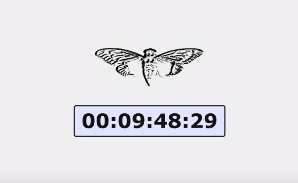
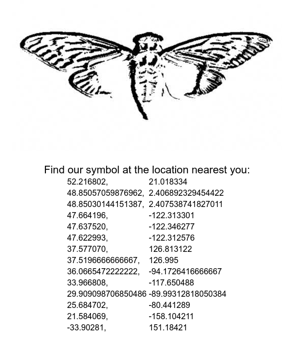

# 845145127.com

## Initial Countdown

The [original final.jpg image](../../01.4chan) had the dimensions of 509 and 503, both of which are prime numbers. These were multiplied with 3301 to equal 845145127, which gave us `http://845145127.com`. Note that 845145127 is also in brackets in the GPG key's name.

The webpage initially looked like this:



The banner image from the counter


File details

```
$ file cicada.jpg
cicada.jpg: JPEG image data, JFIF standard 1.01, aspect ratio, density 1x1, segment length 16, baseline, precision 8, 530x322, components 3
```

## Countdown Over

When the clock ran down, the website changed to this:



The banner image from coordinates


File details

```bash
$ file cicada2.jpg
cicada2.jpg: JPEG image data, JFIF standard 1.01, aspect ratio, density 1x1, segment length 16, baseline, precision 8, 530x322, components 3
```

[Backup of site](site/)


## OutGuess

The initial cicada image contained another OutGuess message.

<details>
    <summary>OutGuess message</summary>

```

-----BEGIN PGP SIGNED MESSAGE-----
Hash: SHA1

You have done well to come this far.

Patience is a virtue.

Check back at 17:00 on Monday, 9 January 2012 UTC.

3301
-----BEGIN PGP SIGNATURE-----
Version: GnuPG v1.4.11 (GNU/Linux)

iQIcBAEBAgAGBQJPCKDUAAoJEBgfAeV6NQkPf9kP/19tbTFEy+ol/vaSJ97A549+
E713DyFAuxJMh2AY2y5ksiqDRJdACBdvVNJqlaKHKTfihiYW75VHb+RuAbMhM2nN
C78eh+xd6c4UCwpQ9vSU4i1Jzn6+T74pMKkhyssaHhQWfPs8K7eKQxOJzSjpDFCS
FG7oHx6doPEk/xgLaJRCt/IJjNCZ9l2kYinmOm7c0QdRqJ+VbV7Px41tP1dITQIH
/+JnETExUzWbE9fMf/eJl/zACF+gYii7d9ZdU8RHGi14jA2pRjc7SQArwqJOIyKQ
IFrW7zuicCYYT/GDmVSyILM03VXkNyAMBhG90edm17sxliyS0pA06MeOCjhDGUIw
QzBwsSZQJUsMJcXEUOpHPWrduP/zN5qHp/uUNNGj3vxLrnB+wcjhF8ZOiDF6zk7+
ZVkdjk8dAYQr62EsEpfxMT2dv5bJ0YBaQGZHyjTEYnkiukZiDfExQZM2/uqhYOj3
yK0J+kJNt7QvZQM2enMV7jbaLTfU3VZGqJ6TSPqsfeiuGyxtlGLgJvd6kmiZkBB8
Jj0Rgx/h9Tc4m9xnVQanaPqbGQN4vZF3kOp/jAN5YjsRfCDb7iGvuEcFh4oRgpaB
3D2/+Qo9i3+CdAq1LMeM4WgCcYj2K5mtL0QhpNoeJ/s0KzwnXA+mxBKoZ0S8dUX/
ZXCkbOLoMWCUfqBn8QkQ
=zn1y
-----END PGP SIGNATURE-----

```

</details>

[OutGuess message (text)](outguess/cicada.jpg.outguess.txt)

The cicada image after the clock ran out contained another OutGuess message. It was the same text on the page with cicada's PGP signature.
<!-- markdownlint-disable blanks-around-lists -->
<details>
    <summary>OutGuess message</summary>

```

-----BEGIN PGP SIGNED MESSAGE-----
Hash: SHA1

52.216802, 21.018334  
48.85057059876962, 2.406892329454422 
48.85030144151387,2.407538741827011  
47.664196,  -122.313301 
47.637520, -122.346277 
47.622993, -122.312576 
37.5196666666667, 126.995 
33.966808, -117.650488 
29.909098706850486 -89.99312818050384 
25.684702, -80.441289 
21.584069, -158.104211 
- -33.90281, 151.18421 
3301
-----BEGIN PGP SIGNATURE-----
Version: GnuPG v1.4.11 (GNU/Linux)

iQIcBAEBAgAGBQJPChn7AAoJEBgfAeV6NQkPZxMP/05D9TkSpwRaBXPqYthuyqxx
uo+ZDyr/yVIlAdurTBiWb3aGxKJjtWg/vlcHcatK0TGL2qaHwB/FFZQAaqOyU7Zf
DXdpWr8PWoWhpWNYUK8IrOaYu1SmWlJnkTdUSzGrX0lbwjwMmJJoPNS7CJuO6MaA
2GIwpv2G7lYqnH3xeX3kzGlPMsVb/wucKRjobsbdbreh1SNuQuRnhfe4s+oHTTqs
XjtGL/VhBI0DUAdfLqW7z4C+Gvbx6okC8x5Sj2N2UTJOiyMYXz5+QyHoA6fo9g5V
6zodNpx/RvxuZP2Ssc9TqERgTo5FjRBpON1vjDalHgg0H2Fus2LK3gh+NZfj1i5b
Oqa4Cqd9epI2pe+glXn86j9crS+2BEAr1cguqAFepvI9sdFEornDja4VXwDtUdM8
9hMVkU5NiTUYfvxZbL6W7rHIF7wxjGUwpe1ViuixG+cKNfv0enrt60PrtDByBOWI
9LLIUE0cB5HDT1xrczZ/55CtuM3Zf07/l0nLFdmgR0oa8KUA9gWcPs6S1EpBa185
VcyOTqbpIPiT8neiJEkXarbJeFk15m1P73Fr8XZxdj7EHK0aOwGYcc8e4PmW/dSh
gcrSNXiePCbcRVRD2n9L47C0LkNyRpoBkmjvtpcRyp5ISe+0xcx/QI+gc1lkSijC
89qV+ymCHae1RiSDxVbd
=ZJ37
-----END PGP SIGNATURE-----

```

</details>

[OutGuess message (text)](outguess/cicada2.jpg.outguess.txt)

## Coordinates

The coordinates can be viewed on a map [here](https://www.google.com/maps/d/u/0/viewer?mid=1YBmUI5hmqE-mvh-Wex3FjKeGxTE&ll=15.53430616129344%2C-97.80413499999986&z=2). At each location, there were posters with one of two QR codes on them.

## Whitespace Change

The website eventually changed again and was filled with whitespace.

[Site Backup](site/whitespace.html)

### Solving

The tabs and spaces proved to be binary and the following message was decoded.

<details>
    <summary>Whitespace Message</summary>

```

-----BEGIN PGP SIGNED MESSAGE-----
Hash: SHA1
 
162667212858
414974253863
598852142735
876873892385
935691396441
316744223127
427566844663
644169769482
889296759263
963846244281
-----BEGIN PGP SIGNATURE-----
Version: GnuPG v1.4.11 (GNU/Linux)
 
iQIcBAEBAgAGBQJPDRkvAAoJEBgfAeV6NQkPVuMP/3ZyAgwsko/B2T9Ew1yqAKVy
K9//wIWCRvMyZ4k79ApqvOJAlezgHTsAM8XG/I71bAG+2wMOXNJfTj/SFONEEbS5
BOp9UP7LHn1j3NKoESrDzsKd+u3oHoNnhs628aLrc8uDqbn/6DNUnObu5Tn3unu0
zZ3NjSs/A5QQX8O56RsK81eSJ2fifbr4NYfHBeUTeVe17nsr48WQI7qc9UVWlPsM
91FWsvhX+WohX8DyFWJmtz0lLvmh3jN+oE8WFPTVbcVCM+eiDt0TqkUNlmq/fxbd
X2Sbs8zMxDXNQWrw58TcSC6oLfXSXZnjh8uTMwrQ0tNdRXHDndgPiurXz62XjVjf
4AhSXBoXF9CHTOyGGEqvfNvFMKyz968iMZDXDNBrM8pkxx1xBHhAnoEznVpeMhII
+IfBTnV8x9lSNgFhmham5eEZlWvqRidqes8EAriqGA6uZokCq7X1IeMHo52ACWmP
2bJsCV5wZDc52c3JnwKe+cAcbsA4OWCNEH29lAsgFw5079BP8lkpY3AH2+8kqs0X
QvqsaMuUq5ZHEaZMgdD0VKYlRrKdhOiDjtJVxoXk1b7YBOV8dZZBXJbEIbTvaof4
yhgUObovx/VFGmsenp+j3nBCxgEO22SgNW3B3pN0yuIMCqccWEZ1nME/QOwLa85n
HOmElIXvK13Q9m545RtP
=Q1Fy
-----END PGP SIGNATURE-----

```

</details>

[Message (text)](decoded/whitespace.txt)

This was the first message not to be signed by 3301's PGP signature.

## References

### TODO

TODO Previous Next
