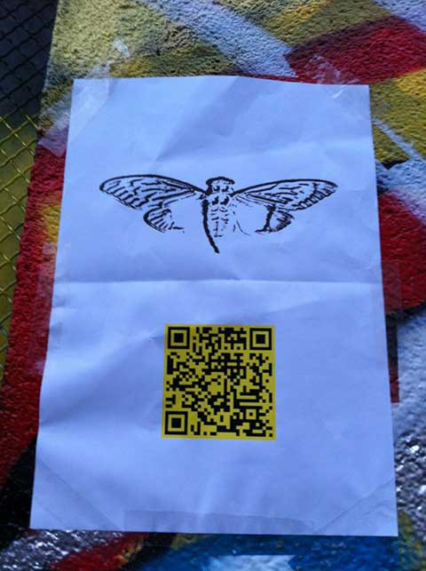
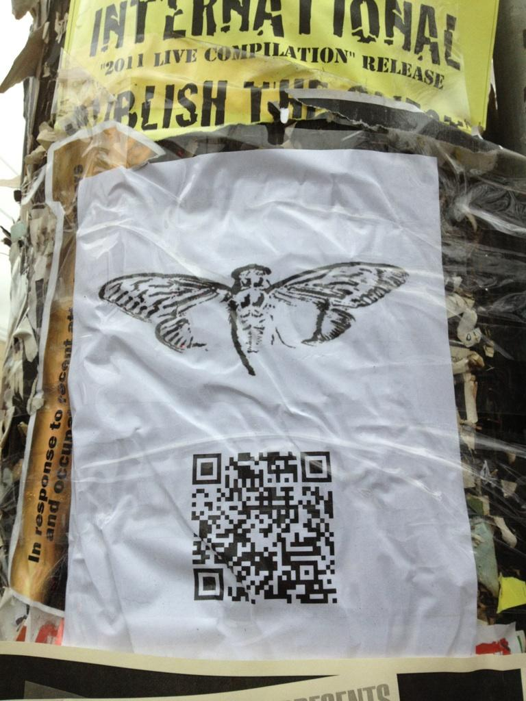
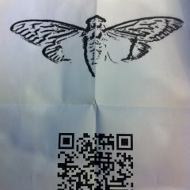
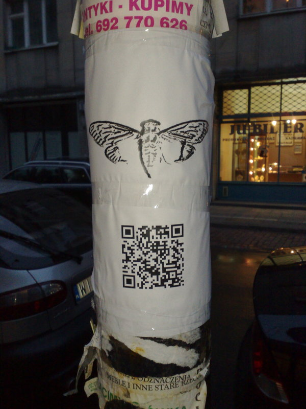
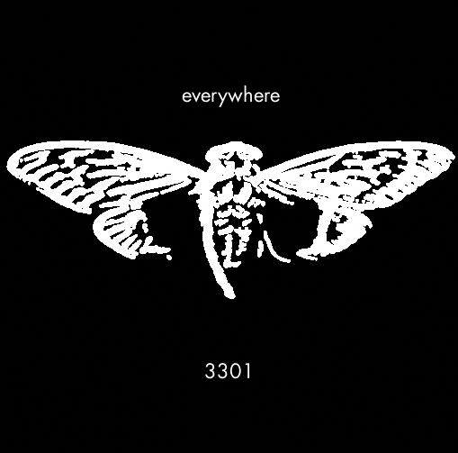

# QR Codes









## Two Images

The QR codes pointed to two images.

### The First Image (Agrippa)


#### File Details

```bash
$ file everywhere.jpg
everywhere.jpg: JPEG image data, JFIF standard 1.01, aspect ratio, density 1x1, segment length 16, baseline, precision 8, 509x503, components 3
```

#### Agrippa OutGuess

<details>
    <summary>First message</summary>

```

-----BEGIN PGP SIGNED MESSAGE-----
Hash: SHA1
 
A poem of fading death, named for a king
Meant to be read only once and vanish
Alas, it could not remain unseen.
 
1:5
152:24
the product of the first two primes
14:13
7:36
12:10
7:16
24:3
271:22
10:7
13:28
12:7
86:17
93:14
the product of the first two primes
16:7
96:4
19:13
47:2
71:22
75:9
77:4
 
You've shared too much to this point.  We want the best,  
not the followers.  Thus, the first few there will receive
the prize.
 
Good luck.
 
3301
-----BEGIN PGP SIGNATURE-----
Version: GnuPG v1.4.11 (GNU/Linux)
 
iQIcBAEBAgAGBQJPB/nmAAoJEBgfAeV6NQkPEnEQAKl5qtb3ZE5vs+c08KuzAi4a
tQEE71fvb65KQcX+PP5nHKGoLd0sQrZJw1c4VpMEgg9V27LSFQQ+3jSSyan7aIIg
SDqhmuAcliKwf5ELvHM3TQdyNb/OnL3R6UvavhfqdQwBXCDC9F0lwrPBu52MJqkA
ns93Q3zxec7kTrwKE6Gs3TDzjlu39YklwqzYcUSEusVzD07OVzhIEimsOVY+mW/C
X87vgXSlkQ69uN1XAZYp2ps8zl4LxoaBl5aVtIOA+T8ap439tTBToov19nOerusB
6VHS192m5NotfQLnuVT4EITfloTWYD6X7RfqspGt1ftb1q6Ub8Wt6qCIo6eqb9xm
q2uVzbRWu05b0izAXkHuqkHWV3vwuSfK7cZQryYA7pUnakhlpCHo3sjIkh1FPfDc
xRjWfnou7TevkmDqkfSxwHwP5IKo3r5KB87c7i0/tOPuQTqWRwCwcWOWMNOS7ivY
KQkoEYNmqD2Yz3Esymjt46M3rAuazxk/gGYUmgHImgcu1zzK7Aq/IozXI7EFdNdu
3EoRJ/UL9Y0l0/PJOG5urdeeTyE0b8bwgfC2Nk/c8ebaTkFbOnzXdAvKHB03KEeU
PtM6d6DngL/LnUPFhmSW7K0REMKv62h9KyP/sw5QHTNh7Pz+C63OO3BsFw+ZBdXL
hGqP6XptyZBsKvz2TLoX
=aXFt
-----END PGP SIGNATURE-----

```

</details>
<br>

* [Outguess message (text)](outguess/everywhere.jpg.outguess.txt)

### The Second Image (Encyclopedia Brittanica)



#### File details

```bash
$ file 162667212858.jpg
162667212858.jpg: JPEG image data, JFIF standard 1.01, aspect ratio, density 1x1, segment length 16, baseline, precision 8, 509x503, components 3
```

#### Encyclopedia Britannica OutGuess

<details>
    <summary>Second message</summary>

```

-----BEGIN PGP SIGNED MESSAGE-----
Hash: SHA1
 
In twenty-nine volumes, knowledge was once contained.
How many lines of the code remained when the Mabinogion paused?
Go that far in from the beginning and find my first name.
 
1:29
6:46
the product of the first two primes
2:37
14:41
17:3
27:40
the first prime
2:33
1:1
7:45
17:29
21:31
12:17
the product of the first two primes
22:42
15:18
24:33
27:46
12:29
25:66
7:47
 
You've shared too much to this point.  We want the best,  
not the followers.  Thus, the first few there will receive
the prize.
 
Good luck.
 
3301
-----BEGIN PGP SIGNATURE-----
Version: GnuPG v1.4.11 (GNU/Linux)
 
iQIcBAEBAgAGBQJPB1luAAoJEBgfAeV6NQkP9oAP+gLu+FsRDf3aRcJtBkCOU2MX
r/dagOTvCKWtuV+fedy0enWUZ+CbUjXOr98m9eq2z4iEGqKd3/MBXa+DM9f6YGUE
jPum4wHtQDSJlZMazuYqJOVZGw5XmF25+9mRM6fe3H9RCiNDZpuXl3MzwdivYhcG
B5hW14PcdHHteQf3eAUz+p+s06RDs+q1sNGa/rMQIx9QRe71EJwLMMkMfs81kfJC
tCt21+8ud0Xup4tjUBwul7QCcH9bqKG7cnR1XWsDgdFP6a4x9Jl2/IUvp1cfeT7B
YLS9W3lCM8thMemJr+ztQPZrpDlaLIitAT2L0B3f/k4co89v5X2I/toY8Z3Cdvoi
hk0AdWzMy/XLDgkPnpEef/aFmnls53mqqe9xKAUQPMrI73hiJ+5UZWuJdzCpvt+F
BjfQk15EJoUUW16K2+mBA1cSd+HJlnkslUTsjkq0E36XKChP+Cvbu/p6DLUMM2Xl
+n3iospCkkHR9QDcHzE4Rxg9A435yHqqJ/sL2MXG/CY8X4ec6U0/+UCIF9spuv8Y
7w66D05pI2u9M/081L7Br0i0Mpdf9fDblO/6GksskccaPkMQ3MRtsL+p9o6Dnbir
6Z2wH2Kw1Bf0Gfx4VcpHBikoWJ5blCc6tfvT+qXjVOZjWAL7DvReavSEmW1/fubN
C3RWcjeI4QET2oKmV2NK
=LWeJ
-----END PGP SIGNATURE-----

```

</details>
<br>

* [OutGuess message (text)](outguess/162667212858.jpg.outguess.txt)

## References

### TODO

TODO Previous Next
