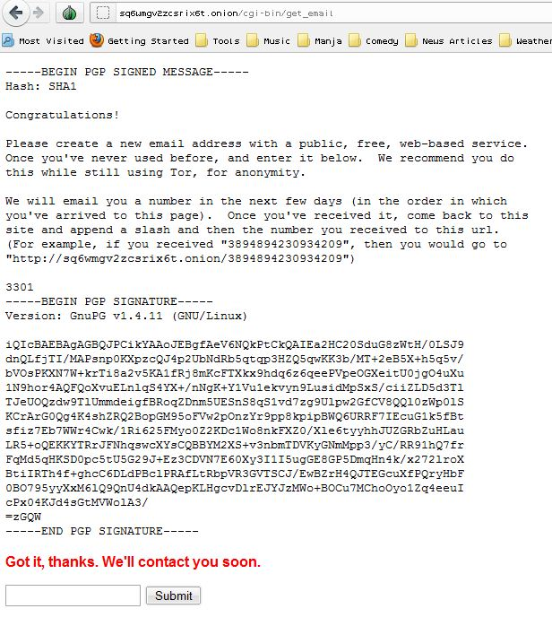

# The Onion

## sq6wmgv2zcsrix6t.onion

After solving the [Agrippa Book Code](../05.two_book_codes#agrippa) we obtained the onion address `sq6wmgv2zcsrix6t.onion`.

Upon visiting the onion, you were greeted with a signed PGP message and input box.

```
Congratulations!

Please create a new email address with a public, free web-based service. Once you've never used before, and enter it below. We recommend you do this while still using tor, for anonymity.

We will email you a number within the next few days (in the order in which you arrived at this page). Once you've recieved it, come back to this page and append a slash and then the number you recieved to this url. (For example, if you recieved "3894894230934209", then you would go to "[http:// http://sq6wmgv2zcsrix6t.onion/3894894230934209]")

3301
```
 

 
[Onion Backup](site)
 
## References
 
### TODO
 
TODO Previous Next
