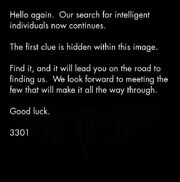

Prev -- [2013.2 Ciada OS](../../2013/02.cicadaOS)

# 2013.01 4Chan Post

In 2013, 366 days after the first image was uploaded, a second image was posted to [/b/](https://4chan.org/b/).



File details

```bash
$ file second.jpg
second.jpg: JPEG image data, aspect ratio 1x1, baseline, 180x182, bit depth 8
```

<details>
    <summary>For searching purposes</summary>

```

Hello again. Our search for intelligent 
individuals now continues.

The first clue is hidden within this image.

Find it, and it will lead you on the road to
finding us. We look forwardto meeting the
few that will make it all the way through.

Good luck.

3301

```

</details>

## Solving

### OutGuess

<details>
    <summary>Book cipher message</summary>
    
```

-----BEGIN PGP SIGNED MESSAGE-----
Hash: SHA1

Welcome again.

Here is a book code.  To find the book, break this riddle:

A book whose study is forbidden
Once dictated to a beast;
To be read once and then destroyed
Or you shall have no peace. 


I:1:6
I:2:15
I:3:26
I:5:4
I:6:15
I:10:26
I:14:136
I:15:68
I:16:42
I:18:17
I:19:14
I:20:58
I:21:10
I:22:8
I:23:6
I:25:17
I:26:33
I:27:30
I:46:32
I:47:53
I:49:209
I:50:10
I:51:115
I:52:39
I:53:4
I:62:43
I:63:8
III:19:84
III:20:10
III:21:11
III:22:3
III:23:58
5
I:1:3
I:2:15
I:3:6
I:14:17
I:30:68
I:60:11
II:49:84
II:50:50
II:64:104
II:76:3
II:76:3
0
I:60:11


Good luck.

3301

-----BEGIN PGP SIGNATURE-----
Version: GnuPG v1.4.11 (GNU/Linux)

iQIcBAEBAgAGBQJQ5QoZAAoJEBgfAeV6NQkPf2IQAKWgwI5EC33Hzje+YfeaLf6m
sLKjpc2Go98BWGReikDLS4PpkjX962L4Q3TZyzGenjJSUAEcyoHVINbqvK1sMvE5
9lBPmsdBMDPreA8oAZ3cbwtI3QuOFi3tY2qI5sJ7GSfUgiuI6FVVYTU/iXhXbHtL
boY4Sql5y7GaZ65cmH0eA6/418d9KL3Qq3qkTcM/tRAHhOZFMZfT42nsbcvZ2sWi
YyrAT5C+gs53YhODxEY0T9M2fam5AgUIWrMQa3oTRHSoNAefrDuOE7YtPy40j7kk
5/5RztmAzeEdRd8QS1ktHMezXEhdDP/DEdIJCLT5eA27VnTY4+x1Ag9tsDFuitY4
2kEaVtCrf/36JAAwEcwOg2B/stdjXe10RHFStY0N9wQdReW3yAOBohvtOubicbYY
mSCS1Bx91z7uYOo2QwtRaxNs69beSSy+oWBef4uTir8Q6WmgJpmzgmeG7ttEHquj
69CLSOWOm6Yc6qixsZy7ZkYDrSVrPwpAZdEXip7OHST5QE/Rd1M8RWCOODba16Lu
URKvgl0/nZumrPQYbB1roxAaCMtlMoIOvwcyldO0iOQ/2iD4Y0L4sTL7ojq2UYwX
bCotrhYv1srzBIOh+8vuBhV9ROnf/gab4tJII063EmztkBJ+HLfst0qZFAPHQG22
41kaNgYIYeikTrweFqSK
=Ybd6
-----END PGP SIGNATURE-----

```

</details>

### Book Cipher

* The cipher led solvers to the book *Liber AL vel Legis*,  by Aleister Crowley.

<details>
    <summary>About *Liber AL vel Legis* </summary>
   Published in 1904, Liber AL vel Legis, commonly known as The Book of the Law, is the central sacred text of Thelema, allegedly written down from dictation mostly by Aleister Crowley, although his wife Rose Edith Crowley is also known to have written two phrases into the manuscript of the Book after its dictation.
</details>

I:46:32 would apply to the 32nd charater, in the 46th line of the 1st chapter. Or more easily:

`Chapter:Line:Character` 

The decoded message:

```bash
https:--www.dropbox.com-s-r7sgeb5dtmzj14s-3301
```

And after replacing dashes with slashes:

```bash
https://www.dropbox.com/s/r7sgeb5dtmzj14s-3301
```

## References

### In Wiki

1. [2013.01 Liber AL vel Legis ](https://www.sacred-texts.com/oto/engccxx.htm) the book used as the key to the book cipher.
2. [2013.01 Second Post](img/second.jpg) the original image posted on [/b/](https://4chan.org/b/). back in 2013.

### TODO

Prev -- [2013.2 Ciada OS](../../2013/02.cicadaOS) 
