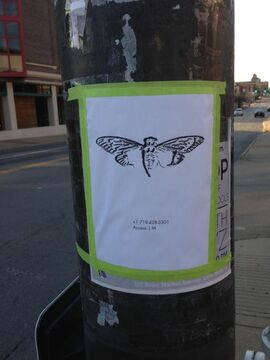
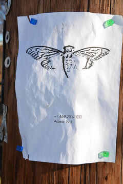

# 2013.03 - The Onions 

## Web browsers are useless here

TODO put onion here - where did all my edits go????????

* Once the site was accessed, users were greeted with this message:

```

Web browsers are useless here.


      ,+++77777++=:,                    +=                      ,,++=7++=,,
    7~?7   +7I77 :,I777  I          77 7+77 7:        ,?777777??~,=+=~I7?,=77 I
=7I7I~7  ,77: ++:~+7 77=7777 7     +77=7 =7I7     ,I777= 77,:~7 +?7, ~7   ~ 777?
77+7I 777~,,=7~  ,::7=7: 7 77   77: 7 7 +77,7 I777~+777I=   =:,77,77  77 7,777,
  = 7  ?7 , 7~,~  + 77 ?: :?777 +~77 77? I7777I7I7 777+77   =:, ?7   +7 777?
      77 ~I == ~77= +777 777~: I,+77?  7  7:?7? ?7 7 7 77 ~I   7I,,?7 I77~
       I 7=77~+77+?=:I+~77?     , I 7? 77 7   777~ +7 I+?7  +7~?777,77I
         =77 77= +7 7777         ,7 7?7:,??7     +7    7   77??+ 7777,
             =I, I 7+:77?         +7I7?7777 :             :7 7
                7I7I?77 ~         +7:77,     ~         +7,::7   7
               ,7~77?7? ?:         7+:77777,           77 :7777=
                ?77 +I7+,7         7~  7,+7  ,?       ?7?~?777:
                   I777=7777 ~     77 :  77 =7+,    I77  777
                     +      ~?     , + 7    ,, ~I,  = ? ,
                                    77:I+
                                    ,7
                                     :77
                                        :

Welcome.

``` 

* Using the clue "Web browsers are useless here" solvers discoved that u had to telnet through TOR onto the site in order to unlock the next clue 

TODO telnet

* Once users had acessed the site through telnet this greeted them:

```bash

Very good.
   
You have done well to come this far.
  
xsxnaksict6egxkq.onion
  
Good luck.
   
3301

``` 


## The Second Site

### Onion 2 

* Solvers followed the second link to another TOR site.
* The website only contained the following:


```bash

Patience is a virtue.

``` 

* But checking the source code for the HTML solvers found:

```bash

<html>
	<head><title>3301</title></head>
	<body>
		Patience is a virtue.
		<!-- which means, come back soon. -->
	</body>
</html>

``` 

* Soon after this the site was updated with the following:

```bash

You already have everything you need to continue.
Sometimes one must "knock on the sky and listen to the sound."
Good luck.

``` 

* This led users to ping the website, every reply from the website contained data bits that when added together produced:

```bash

-----BEGIN PGP SIGNED MESSAGE-----
Hash: SHA1


Well done.  You have come far.

pklmx2eeh6fjt7zf.onion

Good luck.

3301


-----BEGIN PGP SIGNATURE-----
Version: GnuPG v1.4.11 (GNU/Linux)

iQIcBAEBAgAGBQJQ7vVDAAoJEBgfAeV6NQkP9x4P/31A5LPzIhkii8sBjuVxIcOn
4KFQO+uVVsR53zImSqlhq6iVAE9+Ko7vIqjD2whTIUFVYZNBq/92wEZJuCSonovH
HqYZTQihIS9d+QDuwUNvXr4ilrRmITKMrWw3D23rpWs6ZlnehuUDVI8unbN9Zi3h
3hvok3/+/FofLia9Kvbo+FIDi7T9NNRpqepgXd/6dQIP4kn63kKCP20QMdRf2fXF
ZLx5ADS14OvaNFNUAHTJ1qdkPYcdTiNDJkxqk1s82y2doGoEP0ChBUJxlyMiUVXn
1iLOwm2KNrf6If64KxEoetOraWqg9P6l3BjGVPCkrotB608SSs2Lihsa4B0ifI33
ABlpvSDIgpBu/zIO/WFYOfnnrtdvDpVP/Wy+pgqZJ/wOUuhJZhzi5vppjVCm/q9H
C/aXQxa+XXe7his4f9tuIBD1wIYAtnE8M0uDCsfiZjBaZNMnOO7/hOwnNQSBAMcr
KqL5yHSnpI50CtoA+6ycWZURBkrt1rt4eNxsCqQ1XWed/hWbqb6SlJJemJOPbbmt
V5D7iDUO+r2OIUEZTfCSjdzrXcJ8FLtqCGVaLJhCdsyirRHmURwkYLw/B8TpcJQz
qbY6oeDxDosIbE6uhDNV2RVKmpWqLDMhLGHVjkDjJpodE5L3ObbylWuRnHfFqfKH
1mubvMAGo03rxxlY+9XG
=6Sgs
-----END PGP SIGNATURE-----

``` 

## The Thrid Onion

* After visting the site users were told to "standby for coordinates" 

* A List of coordinates was soon produced, LEading solvers to posters that had a phone number and an access code. 

* All the phone numbers ended in either 3001 or 1033

    **These are photos of the posters:**






* When calling the number on the phone vistors were asked for an access.

* The access code given by the posters had to be changed into its gematrified format before being input.

* If the code was correct solvers would then be given this:

```bash

Dataset:13
Offset:12821

Data:28C07E1B102D4D5C4C1A376E064477E1416FCC94928765

``` 

* When the data gived and 560.13 (The thirteenth coming in the database) were XORed together, users were given another onion address.

* Every poster produced a different onion address.

* Below is a set of all the locations and their onion links: 

```bash

Dallas, TX      : y2wyuvrqraowagc5.onion
Okinawa, Japan  : wzwmcwmsk5cb7gjn.onion
Moscow, Russia  : qw7mhchzvuq6f2mf.onion
Little Rock, AR : 4l6uipnstbggwjyv.onion
Annapolis, MD*  : erwfcsdvx6pm2rsk.onion
Portland, OR    : gbyh7znm6c7ezsmr.onion
Columbus, GA    : ll5afyskb6v6g7ga.onion

``` 

> NOTE: The Annapolis poster was never recovered.

## The Secrect Sharing Scheme

TODO to tired to read but think references

* When solvers would vist the sites they were givin SSSS Codes
    <details>
    <summary>About SSSS</summary>

```

Shamir's Secret Sharing Scheme. A secret sharing scheme allows someone to share a secret with a certain number of people, who each get their own string. Once enough of these secrets come together, they can be combined to create the final secret. Each location, its SSSS code and some other data on each part is in the below table:

```
    
</details>

* When 5 of the 10 SSSS codes were found, users got this message:

```bash

p7amjopgric7dfdi.onion

```
 
> NOTE :  THIS IS THE FINAL PIECE OF THE PUZZLE THAT WAS PUBLICLY AVAILABLE, ANYTHING WE KNOW PAST THIS POINT IS FROM LEAKS, AND MAY CALL THE TRUTH OF THESE CLAIMS INTO QUESTION

## Next Puzzle

[2013.04 Leaks](../04.leaks)

## Referenced In

**All images of posters included:**

[Poster 1](img/poster1.jpg)

[Poster 2](img/poster2.jpg)

[Poster 3](img/poster3.jpg)

[Poster 4](img/poster4.jpg)

These photos were taken from the original locations of the posters. 
