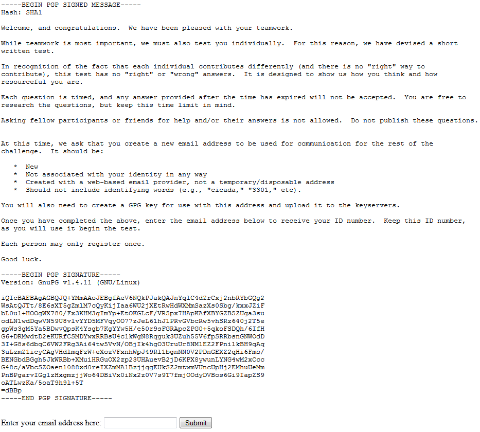

# 2013.04 Leaks

Site p7amjopgric7dfdi.onion screenshot:



```bash

file details: format: PNG,  size: 64.4 KB (65,986 bytes), dimentions: 930 x 840

```


## The Test 

* Inputtig an email gave the solvers a set of questions on a timer: 

* These are the qustions asked:


[Question 1](img/test1.jpg) :

```bash

There is no truth

```

[Question 2](img/test2.jpg) :

```bash

What you are is more important than what you do. 

```

[Question 3](img/test3.jpg) :

```bash

The mathematical operation known as addition is modeled after what? 

```

[Question 4](img/test4.jpg) :

```bash

You cannot step into the same river twice.

```

[Question 5](img/test5.jpg) :

```bash

Two people are standing by a lake. One says, "that's a lovely reflectionin the water." The other says "I see no reflection, but it's a fascinating assortment of fish, plants, and rocks within the water." 

Which one is lying?

```

[Question 6](img/test6.jpg) :

```bash

This sentence is false.

```

[Question 7](img/test7.jpg) :

```bash

Disregarding color blindness, any arbitrary color looks the same to all people.

```

[Question 8](img/test8.jpg) :

```bash

Explain, in your own words, what mathmatical principle is relied upon for the seccurity of Shamir's Secret Sharing Scheme.

```

[Question 9](img/test9.jpg) :

```bash

Name similarities between reality and the concept of the "News Feed" on facebook?

```

[Question 10](img/test10.jpg) :

```bash

1 = 0.99999

```

[Question 11](img/test11.jpg) :

```bash

People who oly study material after the test do better than those who do not study at all. 

```

[Question 12](img/test12.jpg) :

```bash

Grass is only green due to a relationship between grass, light, and your mind.

```

[Question 13](img/test13.jpg) :

```bash

All things are true.

```

[Question 14](img/test14.jpg) :

```bash

I am the voice* inside my head.

*(You undoubtedly just thought "I don't have a voice in my head." That is the voice the question is referring to.)

```

[Question 15](img/test15.jpg) :

```bash

We get hundreds of millions of sensations coming into our minds at any moment. Our brain cant process them all so it categorizes these signals according to our beleif systems. This is why we find evidence to support our beleifs and rarely notice evidence to the contrary.

```

[Question 16](img/test16.jpg) :

```bash

If A is not true, then it must be.

```

[Question 17](img/test17.jpg) :

```bash

In the programing lanuage of your choice, write a function that returns a function that returns the value 3301. 

```

[Question 18](img/test18.jpg) :

```bash

Observation changes the thing being observed.

```

[Question 19](img/test19.jpg) :

```bash

What does the word "it" refer to in the follwoing sentence. It is dark outside?

```

## The Questions

* Questions were given in random order from the 19 possible options. 

* A five minute timer reuired users to awnser the questions qucikly. 

* Questions were usally multiple choice, but some required user input.

* See https://imgur.com/a/YFA1a for the images as well

## Build a Server
 
* This email was sent to solvers after completion of the test: 

``` 

In the programming language of your choice build a TCP server
that implements the protocol below.  The server code must be
written by you and you alone, although you are free to use any
modules or libraries publicly available for the selected
programming language.

Once you have done this, make it accessible as a Tor hidden
service.  Then provide us with the onion address and port
via a GPG-encrypted email to this address.

You have until 0:00 UTC on 3 Feb, 2013.  Any emails received
after that time will be ignored.

Good luck.

3301

====================================================================


1. INTRODUCTION

   The TCP server MUST listen on an arbitrary port, and send and
   receive plain text with lines separated by <CRLF> (representing
   a carriage return followed by a line feed).  The TCP server MUST
   disregard the case of input.

   In the examples below, lines sent by the server will be preceded
   with "S:" and lines sent by the client will be preceded by "C:"

   Each message sent by the server MUST conform to the format:

       [CODE] [RESPONSE NAME] [RESPONSE (optional)]<CRLF>

   Where [CODE] and [RESPONSE NAME] is one of:

       CODE   RESPONSE NAME
        00     Welcome
        01     Ok
        02     Error
        03     Data
        99     Goodbye


2. PROCEDURES

   a. Remote Connection

   Upon receiving a remote connection, the server MUST greet the
   client with a 00 WELCOME message.  The RESPONSE of a welcome
   message MAY contain arbitrary text.  The arbitrary text MUST
   at the very least contain the name of the programming language
   used to implement the server.

   Upon receiving a 00 WELCOME message, the client may begin
   initiating procedures.

   Example:

       S: 00 WELCOME [ARBITRARY RESPONSE TEXT]<CRLF>


   b. RAND [n]
  
   Upon receiving a "RAND" request by the client, the server will
   first send a 01 OK response, and will then provide the client
   with [n] cryptographically random numbers within the range of
   0-255.  Each number MUST be followed by <CRLF>.  After the last
   number has been sent, the server MUST send a dot (.) on a line
   by itself.

   Example:

       C: RAND 3<CRLF>
       S: 01 OK<CRLF>
       S: [first random number]<CRLF>
       S: [second random number]<CRLF>
       S: [third random number]<CRLF>
       S: .<CRLF>


   c. QUINE

   Upon receiving a "QUINE" request by the client, the server will
   first send a 01 OK response, and will then provide the client
   with a quine in the programming language used to implement the
   server.  This quine does not have to be original.  After the last
   line of code has been sent, the server MUST send a dot (.) on a
   line by itself.

   Example:

       C: QUINE<CRLF>
       S: 01 OK<CRLF>
       S: [quine code]<CRLF>
       S: .<CRLF>
  

   d. BASE29 [n]

   Upon receiving a "BASE29" request by the client, the server will
   send a 01 OK response followed by the number [n] converted into
   its base 29 representation.

   Example:

       C: BASE29 3301<CRLF>
       S: 01 OK 3QO<CRLF>


   e. CODE

   Upon receiving a "CODE" request by the client, the server will
   send a 01 OK response followed by its own source code.  After the
   last line of code has been sent, the server MUST send a dot(.) on
   a line by itself.  

   Example:

       C: CODE<CRLF>
       S: 01 OK<CRLF>
       S: [Server Source Code]<CRLF>
       s: .<CRLF>


   f. KOAN

   Upon receiving a "KOAN" request by the client, the server will
   send a 01 OK response followed by a koan.  After the last line of
   the koan, the server MUST send a dot (.) on a line by itself.

   Example:

       C: KOAN<CRLF>
       S: 01 OK<CRLF>
       S: A master who lived as a hermit on a mountain was asked by a<CRLF>
       S: monk, "What is the Way?<CRLF>
       S: "What a fine mountain this is," the master said in reply<CRLF>
       S: "I am not asking you about the mountain, but about the Way.<CRLF>
       S: "So long as you cannot go beyond the mountain, my son, you<CRLF>
       S: cannot reach the Way," replied the master<CRLF>
       S: .


   g. DH [p]

   Upon receiving a "DH" request by the client, the server will proceed
   to perform a Diffie-Hellman key exchange using [p] as the prime modulus.
   The server will then select a base [b] to use in the protocol, as well as
   its secret integer.  The server will then compute its exponent result [e]
   as specified within the Diffie-Hellman key exchange protocol. 

   The server MUST then respond with a 01 OK response followed by the
   selected base [b] and computed exponent [e] separated by white space.

   The client MUST respond with its exponent result [e2], and the client and
   server will follow the rest of the Diffie-Hellman key exchange protocol.

   The server MUST then compute the resulting secret key, and provide it
   using 03 DATA [k].

   Example:

       C: DH 23<CRLF>
       S: 01 OK 5 8<CRLF>
       C: 19<CRLF>
       S: 03 DATA 2<CRLF>


   j. NEXT

   Upon receiving a "NEXT" request by the client, the server will respond
   with 01 OK and then listen for text data to be provided by the client. 
   The client will send a dot (.) on a line by itself after the last line
   of text.  The server MUST record this.  This data will be the next set
   of instructions.  Once the data is received the server will respond
   with 01 OK.

   Example:

       C: NEXT<CRLF>
       S: 01 OK<CRLF>
       C: -----BEGIN PGP SIGNED MESSAGE-----<CRLF>
       C: [MESSAGE CONTENTS]<CRLF>
       C: -----END PGP SIGNATURE-----<CRLF>
       C: .<CRLF>
       S: 01 OK<CRLF>


   i. GOODBYE

   Upon receiving a "DH" request by the client, the server MUST respond with
   99 GOODBYE and then gracefully close the connection.

   Example:

       C: GOODBYE<CRLF>
       S: 99 GOODBYE<CRLF>

 ```

## The Pinging

* 2 weeks later the TCP servers were pinged.
* A log of one of the server testings is below:

```bash
2013/02/25 14:32:01 server is running under address [::]:3307
2013/03/03 10:57:48 got connection from 127.0.0.1:42483
2013/03/03 10:58:05 executing 'rand 3' for 127.0.0.1:42483
2013/03/03 10:58:09 executing 'rand 3' for 127.0.0.1:42483
2013/03/03 10:58:18 executing 'rand 0' for 127.0.0.1:42483
2013/03/03 10:58:29 executing 'rand 1' for 127.0.0.1:42483
2013/03/03 10:58:56 executing 'quine' for 127.0.0.1:42483
2013/03/03 10:59:10 executing 'base29 1033' for 127.0.0.1:42483
2013/03/03 10:59:14 executing 'koan' for 127.0.0.1:42483
2013/03/03 10:59:16 executing 'koan' for 127.0.0.1:42483
2013/03/03 10:59:18 executing 'koan' for 127.0.0.1:42483
2013/03/03 10:59:21 executing 'koan' for 127.0.0.1:42483
2013/03/03 10:59:28 executing 'dh 3301' for 127.0.0.1:42483
2013/03/03 10:59:56 executing 'dh 3301' for 127.0.0.1:42483
2013/03/03 11:00:29 executing 'dh 3301' for 127.0.0.1:42483
2013/03/03 11:00:58 executing 'next' for 127.0.0.1:42483
2013/03/03 11:01:11 executing 'dh' for 127.0.0.1:42483
2013/03/03 11:01:18 executing 'goodbye' for 127.0.0.1:42483
2013/03/03 11:01:18 closing connection to 127.0.0.1:42483
```

## The End

* After this little to no information was given from the participants. 
* We do not know what happened after the ping was sent. 

## References

### Links

[Mock Server Made Is GO](https://pastebin.com/su70yn60)

[Mock Server Made Is Python](https://pastebin.com/CrRvGrkT)

[Imgur For All Test Questions](https://imgur.com/a/YFA1a)


## Prev Next

Back to 2013


