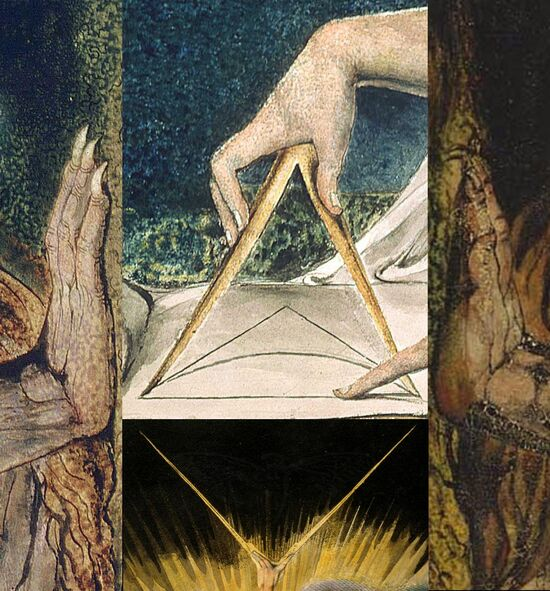
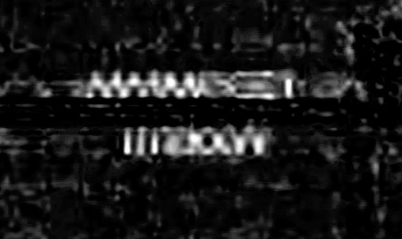
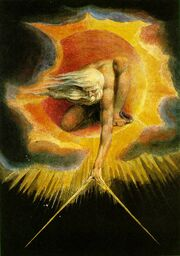
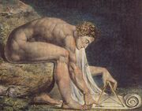
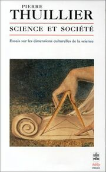
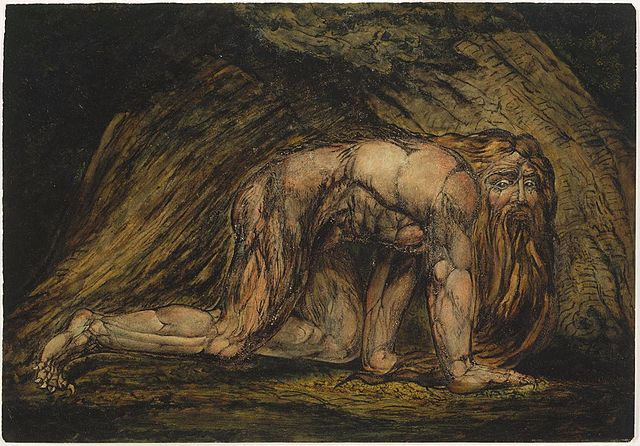

# 2014.02 Liber Primus 

**For information about the cover, see the bottom of the artical.**

## Solved Pages 0 - 16

[Page 0](img/00.jpg)

```

Liber Primus

```

[Page 1](img/01.jpg)

```

A  WARNING

BELIEVE  NOTHING  FROM  THIS  BOOK
EXCEPT  WHAT  YOU  KNOW  TO  BE  TRUE
TEST  THE  KNOWLEDGE
FIND  YOUR TRUTH
EXPERIENCE  YOUR  DEATH
DO  NOT  EDIT  OR  CHANGE  THIS  BOOK
OR  THE  MESSAGE  CONTAINED  WITHIN
EITHER  THE  WORDS  OR  THEIR  NUMBERS
FOR  ALL  IS  SACRED

```

[Page 2](img/02.jpg)

```

Chapter 1 Intus

```

[Page 3](img/03.jpg)

```

WELCOME
WELCOME,  PILGRIM,  TO  THE  GREAT  JOURNEY  TOWARD  THE  END  OF  ALL  THINGS

IT  IS  NOT  AN  EASY  TRIP,  BUT  FOR  THOSE  WHO  FIND  THEIR  WAY  HERE  IT  IS  A  NECESSARY  ONE

ALONG  THE  WAY  YOU  WILL  FIND  AN  END  TO  ALL  STRUGGLE  AND  SUFFERING,  YOUR  INNOCENCE,  YOUR  ILLUSIONS,  YOUR  CERTAINTY,  AND  YOUR  REALITY

ULTIMATELY,  YOU  WILL  DISCOVER  AN  END  TO  SELF

```

[Page 4](img/04.jpg)

```

IT  IS  THROUGH  THIS  PILGRIMAGE  THAT  WE  SHAPE  OURSELVES  AND  OUR  REALITIES
JOURNEY  DEEP  WITHIN  AND  YOU  WILL  ARRIVE  OUTSIDE

LIKE THE INSTAR, IT IS ONLY THROUGH GOING WITHIN THAT WE MAY EMERGE

WISDOM

YOU  ARE  A  BEING  UNTO  YOURSELF

YOU  ARE  A  LAW  UNTO  YOURSELF

EACH  INTELLIGENCE  IS  HOLY

FOR  ALL  THAT  LIVES  IS  HOLY

AN  INSTRUCTION  COMMAND  YOUR  OWN  SELF

```

[Page 5](img/05.jpg)

```

SOME WISDOM
THE PRIMES ARE SACRED

THE TOTIENT FUNCTION IS SACRED

ALL THINGS SHOULD BE ENCRYPTED

KNOW THIS

272       138     shadows 131      151
aethereal buffers void    carnal   18
226       obscura form    245      mobius
18        analog  void    mournful aethereal
151       131     cabal   138      272

```

[Page 6](img/06.jpg)

```

A  KOAN
A  MAN  DECIDED  TO  GO  AND  STUDY  WITH  A  MASTER

HE  WENT  TO  THE  DOOR  OF  THE  MASTER

"WHO  ARE  YOU  WHO  WISHES  TO  STUDY  HERE"  ASKED  THE  MASTER

THE  STUDENT  TOLD  THE  MASTER  HIS  NAME

"THAT  IS  NOT  WHO  YOU  ARE,  THAT  IS  ONLY  WHAT  YOU  ARE  CALLED

WHO  ARE  YOU  WHO  WISHES  TO  STUDY  HERE"  HE  ASKE

```

[Page 7](img/07.jpg)

```

D  AGAIN
THE  MAN  THOUGHT  FOR  A  MOMENT,  AND  REPLIED  "I  AM  A  PROFESSOR"

"THAT  IS  WHAT  YOU  DO,  NOT  WHO  YOU  ARE,"  REPLIED  THE  MASTER

"WHO  ARE  YOU  WHO  WISHES  TO  STUDY  HERE"

CONFUSED,  THE  MAN  THOUGHT  SOME  MORE

FINALLY,  HE  ANSWERED,  "I  AM  A  HUMAN  BEING"

"THAT  IS  ONLY  YOUR  SPECIES,  NOT  WHO  YOU  ARE

WH

```


[Page 8](img/08.jpg)

```

O  ARE  YOU  WHO  WISHES  TO  STUDY  HERE",  ASKED  THE  MASTER  AGAIN
AFTER  A  MOMENT  OF  THOUGHT,  THE  PROFESSOR  REPLIED  "I  AM  A  CONSCIOUSNESS  INHABITING  AN  ARBITRARY  BODY"

"THAT  IS  MERELY  WHAT  YOU  ARE,  NOT  WHO  YOU  ARE

WHO  ARE  YOU  WHO  WISHES  TO  STUDY  HERE"

THE  MAN  WAS  GETTING  IRRITATED

"I  AM,"  HE  STARTED

```


[Page 9](img/09.jpg)

```

BUT  HE  COULD  NOT  THINK  OF  ANYTHING  ELSE  TO  SAY,  SO  HE  TRAILED  OFF
AFTER  A  LONG  PAUSE  THE  MASTER  REPLIED,  "THEN  YOU  ARE  WELCOME  TO  COME  STUDY"

AN  INSTRUCTION

DO  FOUR  UNREASONABLE  THINGS  EACH  DAY

```


[Page 10](img/10.jpg)

```

THE  LOSS  OF  DIVINITY
THE  CIRCUMFERENCE  PRACTICES  THREE  BEHAVIORS  WHICH  CAUSE  THE  LOSS  OF  DIVINITY

CONSUMPTION

WE  CONSUME  TOO  MUCH  BECAUSE  WE  BELEIVE  THE  FOLLWING  TWO  ERRORS  WITHIN  THE  DECEPTION

1    WE  DO  NOT  HAVE  ENOUGH,  OR  THERE  IS  NOT  ENOUGH

```

[Page 11](img/11.jpg)

```

2    WE  HAVE  WHAT  WE  HAVE  NOW  BY  LUCK;  AND  WE  WILL  NOT  BE  STRONG  ENOUGH  LATER  TO  OBTAIN  WHAT  WE  NEED
MOST  THINGS  ARE  NOT  WORTH  CONSUMING

PRESERVATION

WE  PRESERVE  THINGS  BECAUSE  WE  BELIEVE  WE  ARE  WEAK

IF  WE  LOSE  THEM  WE  WILL  NOT  BE  STRONG  ENOUGH  TO  GAIN  THEM  AGAIN

THIS  IS  THE  DECEPTION

```

[Page 12](img/12.jpg)

```

MOST THINGS ARE NOT WORTH PRESERVING
ADHERENCE

WE  FOLLOW  DOGMA  SO  THAT  WE  CAN  BELONG  AND  BE  RIGHT;  OR  WE  FOLLOW  REASON  SO  WE  CAN  BELONG  AND  BE  RIGHT

THERE  IS  NOTHING  TO  BE  RIGHT  ABOUT;  TO  BELONG  IS  DEATH

IT  IS  THE  BEHAVIORS  OF  CONSUMPTION,  PRESERVATION,  AND  ADHEREN

```

[Page 13](img/13.jpg)

```

CE  THAT  HAVE  US  LOSE  OUR  PRIMALITY,  AND  THUS  OUR  DIVINITY

SOME  WISDOM

AMASS  GREAT  WEALTH

NEVER  BECOME  ATTACHED  TO  WHAT  YOU  OWN

BE  PREPARED  TO  DESTROY  ALL  THAT  YOU  OWN


AN  INSTRUCTION

PROGRAM  YOUR  MIND

PROGRAM  REALITY

```

[Page 14](img/14.jpg)

```

A  KOAN

DURING  A  LESSON,  THE  MASTER  EXPLAINED  THE  I

"THE  I  IS  THE  VOICE  OF  THE  CIRCUMFERENCE,"  HE  SAID

WHEN  ASKED  BY  A  STUDENT  TO  EXPLAIN  WHAT  THAT  MEANT;  THE  MASTER  SAID  "IT  IS  A  VOICE  INSIDE  YOUR  HEAD"

"I  DON'T  HAVE  A  VOICE  IN  MY  HEAD,"  THOUGHT  THE  STUDENT,  AND  HE  RAISED  HIS  HAND  TO  TELL  THE  MASTER

THE  MASTER  STOP

```

[Page 15](img/15.jpg)

```

PED  THE  STUDENT,  AND  SAID  "THE  VOICE  THAT  JUST  SAID  YOU  HAVE  NO  VOICE  IN  YOUR  HEAD;  IS  THE  I"

AND  THE  STUDENTS  WERE  ENLIGHTENED

```

[Page 16](img/16.jpg)

```

AN  INSTRUCTION

KWESTION  ALL  THINGS DISCOVER  TRUTH  INSIDE  YOURSELF FOLLOW  YOUR  TRUTH IMPOSE  NOTHING  ON  OTHERS

KNOW  THIS

 434 1311 312  278  966
 204  812 934  280 1071
 626  620 809  620  626
1071  280 934  812  204
 966  278 312 1311  434

```

## Unsolved Pages 17 - 72

[Page 17](img/17.jpg)

<details>
    <summary>Page Info</summary>
Unsolved Page : 0

Grouping : Cross 0-2

Image Size : 2400 x 3600

File Type : .jpg
    
Additional Notes:
N/A
</details>

[Page 18](img/18.jpg)

<details>
    <summary>Page Info</summary>
Unsolved Page : 1

Grouping : Cross 0-2

Image Size : 2400 x 3600

File Type : .jpg

Additional Notes:
N/A
</details>

[Page 19](img/19.jpg)

<details>
    <summary>Page Info</summary>
  Unsolved Page : 2

Grouping : Cross 0-2

Image Size : 2400 x 3600

File Type : .jpg

Additional Notes: N/A
    
</details>

[Page 20](img/20.jpg)

<details>
    <summary>Page Info</summary>
   Unsolved Page : 3

Grouping : Sprials 3-7

Image Size : 2400 x 3600

File Type : .jpg

Additional Notes: N/A

    
</details>

[Page 21](img/21.jpg)

<details>
    <summary>Page Info</summary>
   Unsolved Page : 4

Grouping : Sprials 3-7

Image Size : 2400 x 3600

File Type : .jpg

Additional Notes: There is an anti-aliased apostrophe on line 7(counting from 0)

    
</details>

[Page 22](img/22.jpg)

<details>
    <summary>Page Info</summary>
   Unsolved Page : 5

Grouping : Sprials 3-7

Image Size : 2400 x 3600

File Type : .jpg

Additional Notes: N/A

    
</details>

[Page 23](img/23.jpg)

<details>
    <summary>Page Info</summary>
    Unsolved Page : 6

Grouping : Sprials 3-7

Image Size : 2400 x 3600

File Type : .jpg

Additional Notes: Please take note of the opening quotation mark on line 9(counting from 0). Also note how the opening quotation mark is anti-aliased unlike the rest of the text.

    
</details>

[Page 24](img/24.jpg)

<details>
    <summary>Page Info</summary>
  Unsolved Page : 7

Grouping : Sprials 3-7

Image Size : 2400 x 3600

File Type : .jpg

Additional Notes: Also note the closing quotation marks on line 0. Similar to 6.jpg, they are also anti-aliased. This ends the first set of quotation marks.

    
</details>

[Page 25](img/25.jpg)

<details>
    <summary>Page Info</summary>
    Unsolved Page : 8

Grouping : Branches 8-14

Image Size : 2400 x 3600

File Type : .jpg

Additional Notes: N/A
    
</details>

[Page 26](img/26.jpg)

<details>
    <summary>Page Info</summary>
   Unsolved Page : 9

Grouping : Branches 8-14

Image Size : 2400 x 3600

File Type : .jpg

Additional Notes: N/A
    
</details>

[Page 27](img/27.jpg)

<details>
    <summary>Page Info</summary>
  Unsolved Page : 10

Grouping : Branches 8-14

Image Size : 2400 x 3600

File Type : .jpg

Additional Notes: N/A
    
</details>

[Page 28](img/28.jpg)

<details>
    <summary>Page Info</summary>
  Unsolved Page : 11

Grouping : Branches 8-14

Image Size : 2400 x 3600

File Type : .jpg

Additional Notes: N/A
    
</details>

[Page 29](img/29.jpg)

<details>
    <summary>Page Info</summary>
    Unsolved Page : 12

Grouping : Branches 8-14

Image Size : 2400 x 3600

File Type : .jpg

Additional Notes: N/A
    
</details>

[Page 30](img/30.jpg)

<details>
    <summary>Page Info</summary>
    Unsolved Page : 13

Grouping : Branches 8-14

Image Size : 2400 x 3600

File Type : .jpg

Additional Notes: N/A
    
</details>

[Page 31](img/31.jpg)
<details>
    <summary>Page Info</summary>
    Unsolved Page : 14

Grouping : Branches 8-14

Image Size : 2400 x 3600

File Type : .jpg

Additional Notes: N/A
    
</details>

[Page 32](img/32.jpg)

<details>
    <summary>Page Info</summary>
   Unsolved Page : 15

Grouping : Mobius 15-22

Image Size : 2400 x 3600

File Type : .jpg

Additional Notes: N/A
    
</details>

[Page 33](img/33.jpg)

<details>
    <summary>Page Info</summary>
  Unsolved Page : 16

Grouping : Mobius 15-22

Image Size : 2400 x 3600

File Type : .jpg

Additional Notes: N/A
    
</details>

[Page 34](img/34.jpg)

<details>
    <summary>Page Info</summary>
   Unsolved Page : 17

Grouping : Mobius 15-22

Image Size : 2400 x 3600

File Type : .jpg

Additional Notes: N/A
    
</details>

[Page 35](img/35.jpg)

<details>
    <summary>Page Info</summary>
   Unsolved Page : 18

Grouping : Mobius 15-22

Image Size : 2400 x 3600

File Type : .jpg

Additional Notes: N/A
    
</details>

[Page 36](img/36.jpg)

<details>
    <summary>Page Info</summary>
   Unsolved Page : 19

Grouping : Mobius 15-22

Image Size : 2400 x 3600

File Type : .jpg

Additional Notes: N/A
    
</details>

[Page 37](img/37.jpg)

<details>
    <summary>Page Info</summary>
    Unsolved Page : 20

Grouping : Mobius 15-22

Image Size : 2400 x 3600

File Type : .jpg

Additional Notes: N/A
    
</details>

[Page 38](img/38.jpg)

<details>
    <summary>Page Info</summary>
  Unsolved Page : 21

Grouping : Mobius 15-22

Image Size : 2400 x 3600

File Type : .jpg

Additional Notes: Note the apostrophe on line 1 (counting from 0). It is also anti-aliased, unlike the rest of the text on the page.
    
</details>

[Page 39](img/39.jpg)

<details>
    <summary>Page Info</summary>
   Unsolved Page : 22

Grouping : Mobius 15-22

Image Size : 2400 x 3600

File Type : .jpg

Additional Notes: Another pair of quotation marks can be found here, on lines 3 & 4 (counting from 0) . Anti-aliased as well.
    
</details>

[Page 40](img/40.jpg)

<details>
    <summary>Page Info</summary>
    Unsolved Page : 23

Grouping : Mayfly  23-26

Image Size : 2400 x 3600

File Type : .jpg

Additional Notes: N/A
    
</details>

[Page 41](img/41.jpg)

<details>
    <summary>Page Info</summary>
    Unsolved Page : 24

Grouping : Mayfly  23-26

Image Size : 2400 x 3600

File Type : .jpg

Additional Notes: N/A
    
</details>

[Page 42](img/42.jpg)

<details>
    <summary>Page Info</summary>
    Unsolved Page : 25

Grouping : Mayfly  23-26

Image Size : 2400 x 3600

File Type : .jpg

Additional Notes: N/A
    
</details>

[Page 43](img/43.jpg)

<details>
    <summary>Page Info</summary>
    Unsolved Page : 26

Grouping : Mayfly  23-26

Image Size : 2400 x 3600

File Type : .jpg

Additional Notes: N/A
    
</details>

[Page 44](img/44.jpg)

<details>
    <summary>Page Info</summary>
    Unsolved Page : 27

Grouping : Wing Tree 26-32

Image Size : 2400 x 3600

File Type : .jpg

Additional Notes: N/A

    
</details>

[Page 45](img/45.jpg)

<details>
    <summary>Page Info</summary>
    Unsolved Page : 28

Grouping : Wing Tree 26-32

Image Size : 2400 x 3600

File Type : .jpg

Additional Notes: N/A

    
</details>

[Page 46](img/46.jpg)

<details>
    <summary>Page Info</summary>
    Unsolved Page : 29

Grouping : Wing Tree 26-32

Image Size : 2400 x 3600

File Type : .jpg

Additional Notes: N/A

    
</details>

[Page 47](img/47.jpg)

<details>
    <summary>Page Info</summary>
    Unsolved Page : 30

Grouping : Wing Tree 26-32

Image Size : 2400 x 3600

File Type : .jpg

Additional Notes: N/A

    
</details>

[Page 48](img/48.jpg)

<details>
    <summary>Page Info</summary>
    Unsolved Page : 31

Grouping : Wing Tree 26-32

Image Size : 2400 x 3600

File Type : .jpg

Additional Notes: N/A

    
</details>

[Page 49](img/49.jpg)

<details>
    <summary>Page Info</summary>
    Unsolved Page : 32

Grouping : Wing Tree 26-32

Image Size : 2400 x 3600

File Type : .jpg

Additional Notes: N/A

    
</details>

[Page 50](img/50.jpg)

<details>
    <summary>Page Info</summary>
    Unsolved Page : 33

Grouping : Cuneiform 33-39

Image Size : 2400 x 3600

File Type : .jpg

Additional Notes: N/A

    
</details>

[Page 51](img/51.jpg)

<details>
    <summary>Page Info</summary>
    Unsolved Page : 34

Grouping : Cuneiform 33-39

Image Size : 2400 x 3600

File Type : .jpg

Additional Notes: N/A
    
</details>

[Page 52](img/52.jpg)

<details>
    <summary>Page Info</summary>
    Unsolved Page : 35

Grouping : Cuneiform 33-39

Image Size : 2400 x 3600

File Type : .jpg

Additional Notes: Line 3 (counting from 0), an anti-aliased apostrophe.
    
</details>

[Page 53](img/53.jpg)

<details>
    <summary>Page Info</summary>
    Unsolved Page : 36

Grouping : Cuneiform 33-39

Image Size : 2400 x 3600

File Type : .jpg

Additional Notes: N/A
    
</details>

[Page 54](img/54.jpg)

<details>
    <summary>Page Info</summary>
    Unsolved Page : 37

Grouping : Cuneiform 33-39

Image Size : 2400 x 3600

File Type : .jpg

Additional Notes: N/A
    
</details>

[Page 55](img/55.jpg)

<details>
    <summary>Page Info</summary>
    Unsolved Page : 38

Grouping : Cuneiform 33-39

Image Size : 2400 x 3600

File Type : .jpg

Additional Notes: N/A
    
</details>

[Page 56](img/56.jpg)

<details>
    <summary>Page Info</summary>
    Unsolved Page : 39

Grouping : Cuneiform 33-39

Image Size : 2400 x 3600

File Type : .jpg

Additional Notes: N/A
    
</details>

[Page 57](img/57.jpg)

<details>
    <summary>Page Info</summary>
    Unsolved Page : 40

Grouping : Spiral Branches 40-55

Image Size : 2400 x 3600

File Type : .jpg

Additional Notes: Quotation starts on line 3, ends on line 4 (counting from 0). Quotations marks are AA'd.

Line 8 has another opening quotation mark, and line 10 has it's closing quotation mark. Both are AA'd...unlike the rest of the text. This is a trend we see on all pages with apostrophes or quotation marks.
    
</details>

[Page 58](img/58.jpg)

<details>
    <summary>Page Info</summary>
    Unsolved Page : 41

Grouping : Spiral Branches 40-55

Image Size : 2400 x 3600

File Type : .jpg

Additional Notes: AA'd apostrophe on line 9 (counting from 0).

    
</details>

[Page 59](img/59.jpg)

<details>
    <summary>Page Info</summary>
    Unsolved Page : 42

Grouping : Spiral Branches 40-55

Image Size : 2400 x 3600

File Type : .jpg

Additional Notes: Quotation starts on line 2, ends on line 5. AA'd quotation marks.

Another quotation starts on line 5 as well, and ends on line 0 of 43.jpg

Both sets of quotation marks are AA'd.

    
</details>

[Page 60](img/60.jpg)

<details>
    <summary>Page Info</summary>
    Unsolved Page : 43

Grouping : Spiral Branches 40-55

Image Size : 2400 x 3600

File Type : .jpg

Additional Notes: Closing AA'd quotation mark on line 0(it's opening being on line 5 of 42.jpg).

    
</details>

[Page 61](img/61.jpg)

<details>
    <summary>Page Info</summary>
    Unsolved Page : 44

Grouping : Spiral Branches 40-55

Image Size : 2400 x 3600

File Type : .jpg

Additional Notes: N/A

    
</details>

[Page 62](img/62.jpg)

<details>
    <summary>Page Info</summary>
    Unsolved Page : 45

Grouping : Spiral Branches 40-55

Image Size : 2400 x 3600

File Type : .jpg

Additional Notes: N/A

    
</details>

[Page 63](img/63.jpg)

<details>
    <summary>Page Info</summary>
    Unsolved Page : 46

Grouping : Spiral Branches 40-55

Image Size : 2400 x 3600

File Type : .jpg

Additional Notes: N/A

    
</details>

[Page 64](img/64.jpg)

<details>
    <summary>Page Info</summary>
    Unsolved Page : 47

Grouping : Spiral Branches 40-55

Image Size : 2400 x 3600

File Type : .jpg

Additional Notes: N/A

    
</details>

[Page 65](img/65.jpg)

<details>
    <summary>Page Info</summary>
    Unsolved Page : 48

Grouping : Spiral Branches 40-55

Image Size : 2400 x 3600

File Type : .jpg

Additional Notes: N/A

    
</details>

[Page 66](img/66.jpg)

<details>
    <summary>Page Info</summary>
    Unsolved Page : 49

Grouping : Spiral Branches 40-55

Image Size : 2400 x 3600

File Type : .jpg

Additional Notes: N/A

    
</details>

[Page 67](img/67.jpg)

<details>
    <summary>Page Info</summary>
    Unsolved Page : 50

Grouping : Spiral Branches 40-55

Image Size : 2400 x 3600

File Type : .jpg

Additional Notes: N/A

    
</details>

[Page 68](img/68.jpg)

<details>
    <summary>Page Info</summary>
    Unsolved Page : 51

Grouping : Spiral Branches 40-55

Image Size : 2400 x 3600

File Type : .jpg

Additional Notes: N/A

    
</details>

[Page 69](img/69.jpg)

<details>
    <summary>Page Info</summary>
    Unsolved Page : 52

Grouping : Spiral Branches 40-55

Image Size : 2400 x 3600

File Type : .jpg

Additional Notes: N/A

    
</details>

[Page 70](img/70.jpg)

<details>
<summary>Page Info</summary>
    Unsolved Page : 53

Grouping : Spiral Branches 40-55

Image Size : 2400 x 3600

File Type : .jpg

Additional Notes: Quotation starts on line 2, ends on line 5 (counting from 0). Quotation marks are AA'd.

    
</details>

[Page 71](img/71.jpg)

<details>
<summary>Page Info</summary>
    Unsolved Page : 54

Grouping : Spiral Branches 40-55

Image Size : 2400 x 3600

File Type : .jpg

Additional Notes: N/A

    
</details>

[Page 72](img/72.jpg)

<details>
    <summary>Page Info</summary>
    Unsolved Page : 55

Grouping : Spiral Branches 40-55

Image Size : 2400 x 3600

File Type : .jpg

Additional Notes: N/A

    
</details>


## Solved Pages 73 - 74

[Page 73](img/74.jpg)

```

AN  END

WITHIN  THE  DEEP  WEB,  THERE  EXISTS  A  PAGE  THAT  HASHES  TO

36367763ab73783c7af284446c

59466b4cd653239a311cb7116

d4618dee09a8425893dc7500b

464fdaf1672d7bef5e891c6e227

4568926a49fb4f45132c2a8b4
IT IS THE DUTY OF EVERY PILGRIM TO SEEK OUT THIS PAGE

```

[Page 74](img/74.jpg)

```

Parable :

Like the instar tunneling to the surface.

We must shed our own circumferences.

Find the divinity within and emerge.

```

## The Cover



### Details

* Size: 2.13 MB (2,242,034 bytes)
* Dimensions: 854 x 918
* Width: 854 Pixels
* Height: 918 Pixels
* Bit Depth: 32

### Discoveries

[Original Image:](img/dis1.jpg)

* At the tip of where the finger is pointing from image 2, (Found Below) numbers were found.
Example:

 
 
```

Image Info:
__________________________________

    Width: 508 Pixels
    Height: 303 Pixels
    Vertical resolution: 96 dpi
    Horizontal resolution: 96 dpi
    Bit depth: 24
    File typ: jpg
_________________________________
```

## Chat Logs From Discovery Time

<details>
    <summary>Chat Logs</summary>

[14:42] <GenPop44: might be something. Newton in onion on is holding a Golden Compass. = 619 prime based upon a book "northern lights" by philip pullman. lots of Uriel, blake influence.

[14:42] <gonflynn: mass, i find that a strange coincidencee


<NEM0: this is the difference between original and  our blake.jpg @400% zoom http://prntscr.com/2k19rz

<NEM0: @1000% http://prntscr.com/2k1a5o

[12:08] <stagnantcluelack> is it just me or does the collage look a little bit like a thelema star? Crowley_unicursal_hexagram.svg/500px-Crowley_unicursal_hexagram.svg.png

[12:45] <typhoid: its not a pyramid

[12:45] <typhoid: its not the thelema star

[12:45] <typhoid: Masonic_SquareCompassesG.svg/456px-Masonic_SquareCompassesG.svg.png
______________________________________

from #cicadasolvers 15/1/2014 0536 GMT
______________________________________

[06:36] <azzy23: In the square & compass symbol, there is a G in the middle. The G is a Ghemel, which is representative of god, and carries the numeric value of 3

[06:36] <azzy23: both of the Blake hands are holding a compass.

[06:37] <azzy23: The one on top comes from a painting of Newton, the one on bottom is god... science above faith.

[06:37] <azzy23: The hands on the sides are from the painting Nebechenezzur, which represents the fall into man's bestial nature

[06:37] <cydoniac: Where are you seeing that symbol?

[06:37] <BlueFox: yes, they are, but if you overlay onto the matrix page, the finger points 
somewhere, no?

[06:37] <azzy23: http://www.masonic-lodge-of-education.com/square-and-compasses.html

[06:37] <TaiiwoBot: ^ SQUARE AND COMPASSES - Freemasonry's Logo http://tinyurl.com/pqw9j3q ^

[06:38] <azzy23: if you take the Blake painting into paint or something, draw in the lines

[06:38] <L4T1V3: yeah the second line

[06:38] <azzy23: it looks like the square & compass, sans the G

[06:38] <azzy23: the finger is pointing to the middle, where the G would be

[06:38] <azzy23: and the G represents the number 3, in numerology

[06:38] <azzy23: (it's god, and god is always 3)
    
</details>

## Cover Picture Origins

* These Images below are the sources of the liber Primus Cover images



Copy D, Object 1; Bentley 1, Erdman I, Keynes I; Europe a Prophecy — British Museum



Isaac Newton is shown sitting naked and crouched on a rocky outcropping covered with algae, apparently at the bottom of the sea. His attention is focused upon diagrams he draws with a compass upon a scroll. The compass is a smaller version of that held by Urizen in Blake's The Ancient of Days.



Page Bibliographique de Pierre Thuillier.



William Blake - Nebuchadnezzar (MFA Boston)

## Referenced

1. https://en.wikipedia.org/wiki/Nebuchadnezzar_%28Blake%29
2. https://khalatnost.files.wordpress.com/2009/10/nebuchadnezzar-tate-collection.jpg
3. https://upload.wikimedia.org/wikipedia/commons/0/0e/Newton-WilliamBlake.jpg
4. https://upload.wikimedia.org/wikipedia/commons/f/f6/Europe_a_Prophecy%2C_copy_D%2C_object_1_%28Bentley_1%2C_Erdman_i%2C_Keynes_i%29_British_Museum.jpg

### Additional Refrences

http://gyazo.com/d92c9999e6e2cc62b4a2025bcc01cf72

http://i.imgur.com/pGl8T7k.png

http://imgur.com/fhKoXqR

http://i.imgur.com/kyoaVG2.png

http://i.imgur.com/159kitn.jpg

http://imgur.com/xFHyW28

http://prntscr.com/2h4xnz

http://i.imgur.com/HHP5yn6.png http://prntscr.com/2hezte
